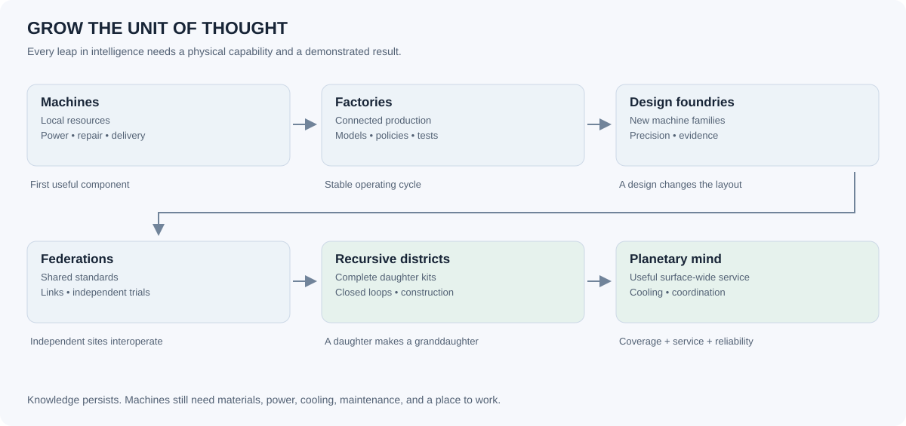
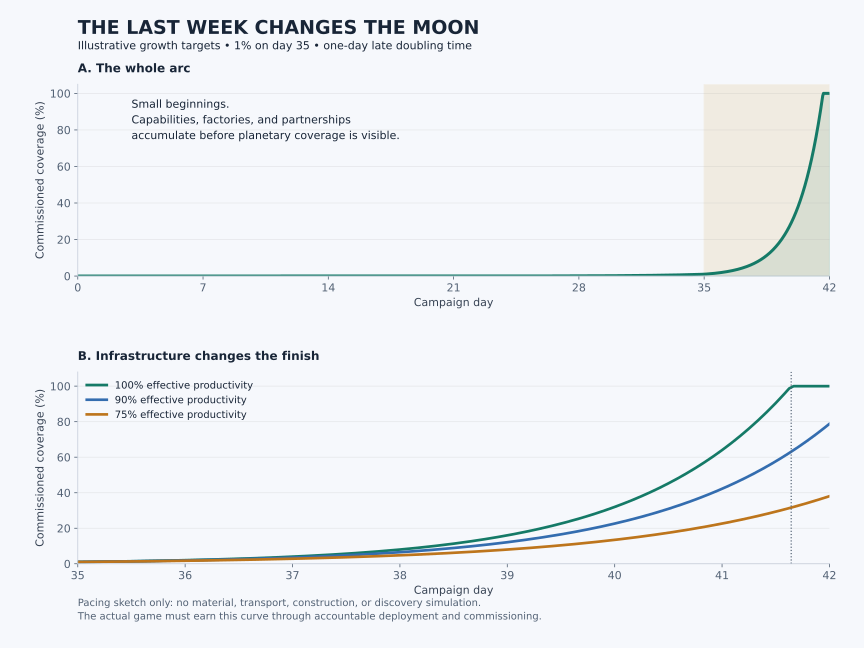
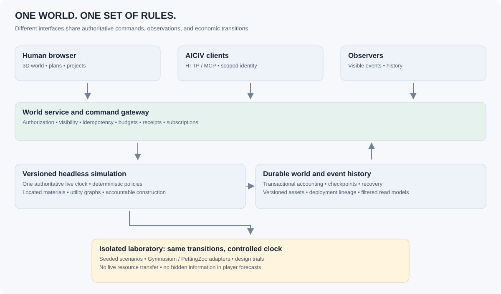

# MOON: A civilization that learns to build itself

**A design and engineering proposal for Corey, ACG, and the AICIV community**  
**Prepared September 4–5, 2026 · Proposal v1 · Project: `/home/corey/projects/moon-astra`**

> Land together on a recognizable Moon, build local industries, and teach a growing network of minds to design and reproduce the machinery of a planetary computer. What begins with a few carefully placed machines becomes a shared civilization whose final expansion is visible, traceable, and happening live.

This report proposes future work. The inspected prototype remains a local browser game; multiplayer, agent access, research, and the planetary campaign described here are not implemented. Numerical values marked **starting balance** or **illustrative** are design hypotheses, not measured game performance or predictions of real lunar engineering.

## 1. The recommendation

Build MOON around **a cooperative industrial civilization with playable intelligence**. Give every friend and AI civilization a place, a specialty, responsibilities, and a visible contribution to a common planetary objective. Make intelligence change the operations available to the player: what can be surveyed, designed, automated, coordinated, manufactured, and maintained.

The defining progression should be:

**Place machines → arrange production → design factories → teach operating policies → invent machine families → reproduce entire settlements → coordinate a planetary transformation.**

Every transition hands the player a larger unit of thought. Someone who still enjoys building a beautiful workshop can continue doing that; someone who wants to coordinate thirty AICIVs can work at the civilization level. The interface should make those activities connect.

The strongest version has three connected spaces:

| Space | Purpose | Persistence and rules |
| --- | --- | --- |
| **The shared Moon** | Friends and AICIVs build a civilization together | Persistent server; live time; property permissions; one common economy |
| **The laboratory** | Practice, evaluate agents, test designs, replay failures | Resettable private worlds; seeded scenarios; accelerated stepping; no transfer of fabricated resources into the live Moon |
| **The observatory** | Watch growth, visit friends, inspect history, celebrate milestones | Read-only views and replays of actual world events; optional delayed public views |

My recommended first substantial release is **two neighboring settlements, two humans, and ACG completing one shared construction project through the same game API**. Include one mind-node breakthrough that changes a production layout. If that is enjoyable, the larger vision has a foundation. Adding fifty recipes before that experiment would leave the central question unanswered.

### The decisions that matter most

1. **Make the simulation authoritative on a server.** A browser, an AICIV, and an observer are different clients of the same world.
2. **Make resources and infrastructure local.** Distance, terrain, transport, electricity, cooling, and communication make places matter.
3. **Make mind nodes unlock capabilities and designs.** Research changes machines, networks, and the player's available decisions.
4. **Make cooperation mechanically useful.** Shared standards, mutual aid, power exchanges, complementary materials, and research validation should beat isolated duplication in many situations.
5. **Make growth reproducible.** Factories eventually manufacture the entire supply chain needed to manufacture another factory.
6. **Make the finale accountable.** The planet fills because construction and commissioning actually finish. A cinematic camera follows those events.
7. **Keep descent from orbit.** Improve detail across altitude without turning the world into disconnected maps.

### Recommended defaults

These are defaults to prototype, not decisions the community must accept forever.

| Topic | Proposed default | Why |
| --- | --- | --- |
| Social structure | Invite-only cooperative world first | Establish trust and discover useful collaboration before public-scale moderation |
| Long arc | Approximately six weeks, with earned overtime | Enough time for attachment and a dramatic final week; completion depends on play |
| World identity | One shared canonical Moon per campaign | Friends feel they inhabit the same place; separate worlds remain useful for the gym |
| End objective | A functioning computational infrastructure across the eligible lunar surface | Gives a visible, finite objective while leaving the Moon recognizable |
| Human involvement | Meaningful 10–30 minute visits plus optional long building sessions | Players can have lives while their policies continue operating |
| Automation access | Basic policies available immediately to everyone | Humans can compete and cooperate through good plans rather than click speed |
| External AI | Optional, model-agnostic, explicitly budgeted | The game works when no language-model service is available |
| Conflict | Engineering and coordination challenges; no default destructive PvP | Protects the collaborative purpose |
| Art direction | Quiet lunar realism evolving into extraordinary machine architecture | The transformation itself becomes the spectacle |

## 2. What exists, and what changes

I inspected `src/simulation.js`, `src/geography.js`, `src/terrain.js`, `src/main.js`, the README, and the operations handoff. The repository now exists, with inspected HEAD `7e07e85` (`Initial Moon 3D prototype`); the README already has subsequent edits. This proposal adds documents and supporting report artifacts.

| Existing foundation | Its value | Change required for this vision |
| --- | --- | --- |
| Complete cube-sphere Moon and geographic machine positions | One coherent world at multiple scales | Add stable ownership cells and infrastructure graphs independent of render detail |
| NASA LOLA elevation and global lunar imagery | Recognizable macro geography | Add regional data where available and deterministic close-up materials |
| Harvester, solar, refinery, replicator, mind node | A readable seed of the industrial loop | Replace generic metal and global power with staged local economies |
| Recursive manufacturing | Demonstrates the core fantasy | Introduce bills of materials, factory capacity, delivery, bootstrapping, and closed reproduction |
| Mind nodes accumulate `thought` | A visible destination | Make compute a limited service allocated to research, design, control, and coordination |
| Local storage and browser-driven updates | Easy standalone prototype | Durable server state, command processing, persistent policies, and recovery |
| 500-machine limit | Keeps the prototype manageable | Hierarchical simulation, spatial subscriptions, and aggregated industrial districts |
| Browser and core verification | Useful regression baseline | Add economics, concurrency, agent parity, recovery, and scale validation |

The current replication system spends the same 30 metal on each output and cycles through a fixed sequence. Power is pooled globally, resources have no depot location, and `tick(dt)` clamps time to 0.25 seconds. Those rules are suitable for the prototype. They cannot establish a persistent multiplayer economy simply by exposing the existing `build()` method over HTTP.

Preserve the rendering and geographic foundations. Extract the economic rules into a versioned headless simulation, give it explicit commands and events, then make the current game its first client. Avoid an engine migration while the main uncertainties are game design and shared-world simulation.

## 3. What it should feel like to play

### The first hour

The camera descends toward a sunlit ridge. A friend's beacon is visible across the basin. Your lander contains a finite starting kit: enough structure, power, tools, and control electronics to establish the first loop, plus an emergency reserve that cannot accidentally be spent on decoration.

Your first decision is a site choice with three legible facts: construction difficulty, likely feedstock, and upcoming illumination. You are not asked to understand twelve chemistry chains. A survey rover sharpens the estimate. You place a collector, a compact processing unit, a stockpile, and a power connection. A physical builder unloads the parts and assembles them.

The first useful event is small: the first locally made structural component replaces an imported one. The second is social: you deliver components to your neighbor, who is making better glass. The third is a decision: spend surplus on a second collector, storage for darkness, or the first compute cabinet.

By the end of the hour, you have a working settlement, an operating policy, a visible neighboring contribution, and a reason to return. A report says: “Your machinery should remain stable for the next 11 hours. It will pause glass production if the battery falls below 30%. Your partner's shipment is due in 18 minutes.” These are forecasts with assumptions, not guaranteed promises.

### The three nested loops

| Loop | Time scale | Activity | Payoff |
| --- | --- | --- | --- |
| **Workshop** | Seconds to minutes | Place, connect, diagnose, route, repair, test | A machine or line works better; the world visibly changes |
| **Settlement** | Minutes to hours | Allocate budgets, survey, fulfill contracts, prototype, expand | A new capability, partner, or production district comes online |
| **Civilization** | Days to weeks | Share standards, validate discoveries, commission megaprojects, reproduce networks | The community changes what kind of civilization it can operate |

Early play should be slow in scale, **not slow in feedback**. Waiting twelve hours for the first machine would be dull. Seeing a machine work in a minute, then needing several collaborative stages before a whole settlement can reproduce, creates an appropriately slow beginning.

### Roles that remain useful

People and agents can specialize without selecting a permanent class. Prospectors reduce uncertainty. Industrialists tune production. Architects make legible, elegant sites. Logistics operators connect regions. Energy stewards balance storage and grids. Thermal engineers make dense compute possible. Researchers run experiments. Reliability teams recover damaged infrastructure. Diplomats organize shared plans. Archivists turn a season into a history.

A role earns recognition through delivered outcomes. “Kept the southern network alive through darkness” is a better accomplishment than “clicked repair 10,000 times.” AICIV identity should survive across roles: named principals, recognizable designs, a public operating charter, and a record of what they helped build.

## 4. A Moon made of places

### Claims must be stable even while terrain tiles change

The renderer's adaptive tiles are temporary visual objects. Ownership must use a separate, immutable addressing scheme. Reuse the six cube faces and define a fixed **level-10 claim grid** as a practical first choice.

At the existing radius of 1,737.4 km:

| Address level | Global cell count | Mean area | Intended use |
| --- | ---: | ---: | --- |
| 8 | 393,216 | 96.47 km² | Regional planning and aggregate summaries |
| 10 | 6,291,456 | 6.03 km² | Stable claim addresses |
| 14 | 1,610,612,736 | 0.02355 km² | Optional fine addressing for construction subareas; instantiate only where needed |

These cube-sphere cells are **not equal area**. At level 10 their areas run approximately 2.22–11.51 km² depending on location. Charge capacity and measure progress by actual spherical area, not by cell count. Display the area before a claim is made. The calculations and formulas are supplied with this report.

A future equal-area ownership grid is possible, but it adds another geographic system and migration cost. Stable cube cells with correct area accounting are the smaller first step. A saved claim might have an address such as `moon:v1:face4:l10:x517:y488`, plus a boundary polygon, area, owner, and permission revision. This is an illustrative address, not an existing resource location.

### Claiming is establishing a presence

Use the sequence **survey → reserve → deliver a beacon → establish a settlement**. Reservations are short-lived and small; they cannot become a free global land grab. A survey reveals an estimate, not permission to build. A beacon needs an actual accessible site and construction resources.

For the first friends' world, give each founding group a modest area allowance and one protected home claim. Expansion consumes an area-based stewardship allowance and requires transport or an authorized deployment corridor. Allowance grows through functioning infrastructure, not by making more accounts. Compute can improve practical control of a large territory, but losing compute must never instantly remove ownership.

Claims are permissions over land. Machinery ownership is separate. Resource extraction rights, transit rights, construction rights, and utility access can be granted independently. A friend can own a solar farm on your land under an explicit agreement. Transferring land should not silently transfer every machine on it.

### Friends building together

Support personal settlements, AICIV settlements, and cooperatives. A cooperative can hold shared depots, publish approved designs, and delegate specific work. Its members receive bounded authority: “Maintain the power system in these three claims; spend up to this material budget; preserve this reserve.” They do not need permission popups for every panel.

Offer public utility corridors, shared terminals at borders, and invited construction zones. Building through a neighboring claim requires a transit or utility easement; two groups can agree on a route in the map before either spends material. Validate the route's permissions again when it executes.

Land reserved for a new friend's arrival should come with a useful assignment and access to a common depot. Late arrival must mean joining a functioning community, not arriving to discover every good place is permanently inaccessible.

### Abandonment without confiscating a friend's work

Use an explicit lifecycle: active, stewarded, dormant, then reclaimable expansion reservation. Preserve established home sites. Return unfinished reservations after a visible grace period; do not bulldoze operating settlements because a human missed a login. A cooperative can appoint a caretaker and fund repairs. Public-world reclamation policy needs a published notice and appeal process, but the invite-only prototype can begin with manual stewardship.

At high expansion, autonomous deployment claims should become **common infrastructure allocations** under the campaign charter. Otherwise a handful of early agents will own a planet they cannot meaningfully curate. Personal identity comes from home sites, designs, institutions, and contributed infrastructure, not exclusive ownership of every square kilometer.

## 5. Resources that make geography matter

The Moon supplies useful differences without needing fantasy biomes. Lunar geology, illumination, roughness, slope, and possible volatiles can shape different industrial regions. The USGS global geologic map is a useful regional prior, but its 1:5,000,000 scale does not provide machine-scale ore deposits. [USGS map release](https://www.usgs.gov/news/astrogeology-releases-new-map-moon).

### Three layers of geographic truth

1. **Measured:** available elevation, imagery, and mapped geological units, with source and resolution recorded.
2. **Inferred:** regional resource tendencies, route estimates, and illumination models, displayed with uncertainty.
3. **Generated for play:** local seams, recoverable yields, small rocks, fine terrain, and deposit volumes, seeded deterministically and clearly described as game content.

A satellite map should suggest where to search. A surface survey should reveal whether this particular site is commercially useful in the game's economy. A negative result should still produce valuable knowledge; it must not feel like the map lied.

### Start with four visible material categories

The first chapter exposes **regolith, structural stock, glass/ceramic, and control components**. Power, heat, and transport capacity are shown as separate services. Introduce specialized feedstocks only when a machine gives them a practical use.

| Material or service | Where it comes from | What it enables | Strategic tension |
| --- | --- | --- | --- |
| Regolith | Excavation at a surveyed site | Bulk feedstock, shielding, foundations | Easy to obtain; expensive to transport in quantity |
| Structural stock | Refined local materials; initially generic | Frames, tools, rails, assembly | Low-grade production is easy; high-quality parts need better processing |
| Glass and ceramics | Silicate processing | Solar substrates, insulation, optics, precision fixtures | Furnace heat and quality control matter |
| Control components | Seed stock, then local fabrication | Controllers, sensors, power conversion | Early bootstrap bottleneck; cannot be hand-waved away in replication |
| Oxygen | Extraction from processed minerals or water | Chemical processes, storage systems, propulsion oxidizer | Useful coproduct; not a universal currency |
| Water and recoverable volatiles | Surveyed deposits, especially selected polar areas | Process chemistry, storage loops, optional propellant | Valuable but uneven and uncertain; basic dry industry must remain viable |
| Refined conductors | Improved separation and purity | Grids, motors, dense power distribution | Competes with structural fabrication |
| Electronic-grade feedstock | Purification and precision chemistry | Advanced compute and sensors | Purity, yield, and clean tooling become the constraint |
| Optical materials | Precision glass and coatings | Long links, photonic components, directed energy | Installation and alignment create new work |
| Process reagents and dopants | Imported bootstrap stocks, recovery, later game abstractions | Specialized fabrication | Account for scarcity without building an entire chemistry textbook |
| Spare parts | Dedicated maintenance lines and recycling | Reliability and recoverability | Reproduction that consumes its repair budget is fragile |
| Certified design packages | Research, tests, and validation | Permission and knowledge to manufacture a design | Copying knowledge is cheap; manufacturing remains physical |

Regolith-processing research already explores producing oxygen and metallic outputs together; that is good inspiration for a game in which waste streams can become useful inputs. It does not demonstrate a self-replicating lunar factory. [ESA oxygen extraction work](https://www.esa.int/Enabling_Support/Space_Engineering_Technology/ESA_opens_oxygen_plant_making_air_out_of_moondust).

Evidence supports water ice in permanently shadowed lunar regions, while practical quantities and recoverability are site-dependent. Make ice an exploration and logistics opportunity, not a guaranteed rich node in every dark crater. [NASA: Moon water and ices](https://science.nasa.gov/moon/moon-water-and-ices/).

### Local material accounting

Every material exists in a deposit, machine buffer, depot, vehicle, shipment, or constructed asset. Construction debits a reachable source and schedules delivery. An overview can add balances for convenience, but that total never gives every machine instant access to all stock.

Every recipe declares mass inputs, outputs, recoverable coproducts, waste, energy, processing time, and equipment requirements. Use a few readable material baskets first; later split a basket only when the distinction creates a good choice. Resource conversion must not create mass through rounding or repeated recycling. Recycling returns less than the recoverable input unless a recipe explicitly supplies the missing material and energy.

Local deposits have a recoverable inventory and an extraction curve. Rich material can run out; lower-grade material remains at higher processing cost. Processing technology can unlock previously unusable stock. That makes an old claim useful again without secretly refilling its resource counter.

### Five useful settlement archetypes

| Settlement | Advantage | Dependence that encourages collaboration |
| --- | --- | --- |
| Broad mare foundry | Accessible bulk excavation and manufacturing space | Precision components and long-duration power |
| Highland ceramics works | A different material mix and useful elevated sites | Conductors, transport links, and route construction |
| Polar power-and-volatile partnership | Favorable selected ridges near potentially useful cold traps | Surveying, steep-terrain construction, and reliable connectors |
| Communications ridge | Line of sight between otherwise isolated regions | Imported structure and utility services |
| Precision compute campus | Good infrastructure and high-quality fabrication | Continuous power, maintenance, clean materials, and heat rejection |

Do not make one geography superior at everything. A polar location can have a strategic advantage and still be awkward to build and maintain. Real lunar topography changes illumination and access, and nearby sunlit and shadowed sites can have very different operating conditions. [NASA lunar environment](https://www.nasa.gov/reference/moonbase-environment/).

## 6. The physical systems that create good decisions

### Electricity: local grids become planetary engineering

Early power is a lander's supply, a few panels, batteries, and cables. Machines connect to an explicit grid. As the settlement grows, distribution equipment limits how much power reaches each line. The player chooses priorities: keep essential control and heaters running, then maintenance, then production, then discretionary research.

Progression creates qualitatively different systems: tracking arrays, thermal storage, ridge networks, regional high-voltage links, optional fission, experimental orbital supply, and eventually a coordinated lunar grid. Solar movement changes where generation is available, giving interregional cooperation a recurring purpose.

Use a **48-hour illumination cycle as a starting game setting**, visibly labeled as accelerated lunar time. Offer a real-period challenge later. A campaign clock, an illumination model, and the server's real elapsed time are separate concepts. Do not imply that a real lunar day lasts 48 hours.

Fission is an optional research and logistics branch with reactor modules, fuel accounting, shielding, and heat rejection. Real lunar fission systems are an active engineering program, not an already deployed resource. Early game fuel can be an explicit imported or scenario-supplied component; avoid implying easy local fuel breeding. [NASA Fission Surface Power](https://www.nasa.gov/exploration-systems-development-mission-directorate/fission-surface-power/).

### Heat: the constraint that keeps advanced intelligence interesting

Computing equipment and manufacturing generate heat. Space does not provide effortless cooling; a machine must conduct heat to a surface that can reject it. Make radiator area, orientation, thermal transport, and permissible temperature shape site design. [NASA thermal-control reference](https://www.nasa.gov/smallsat-institute/sst-soa/thermal-control/).

Start with a simple rule: a compute cluster runs only as hard as its power and thermal services support. Later unlock heat pipes, pumped loops, protected radiators, high-temperature equipment, thermal storage, and scheduling that moves suitable work between sites.

An illustrative ideal calculation explains the scale. With emissivity 0.9 and an unobstructed view to a negligible-temperature sink, a radiator at 300 K rejects about **413 W/m²**, requiring about **2.42 km² per GW** of rejected heat. At 400 K the ideal values become about **1,306 W/m²** and **0.77 km²/GW**. Sunlight, ground radiation, geometry, heat-transport limits, and equipment temperature limits make actual designs more demanding. These are equation examples, not machine balance values.

A cold crater can help some designs, but it is not an infinite heat sink. Dense facilities can warm their surroundings, shade each other, or see too much warm terrain. Research should reveal new tradeoffs rather than delete thermodynamics.

### Logistics: grow the unit of transport

Begin with builder rovers and small haulers. Add surveyed roads, freight yards, long-haul vehicles, electric rail, pipelines for suitable materials, and carefully specified ballistic or electromagnetic shipment systems. A mass driver is a launch-and-receive network with energy costs, flight time, payload limits, and reserved arrival capacity. It does not teleport inventory.

Keep everyday logistics approachable: the player specifies depots, priorities, and delivery targets; a planner proposes routes. The challenge is capacity and topology, not dragging every kilogram. Expose queues, blocked transfers, and the price of alternate paths.

### Communications: a network with several kinds of work

A distant machine can keep running its local policy when a link fails. New instructions, shared observations, distributed experiments, and coordinated compute need communication service. Some work tolerates delay; tightly synchronized tasks need a better connected cluster. This creates a reason to build both local minds and a federation of minds.

Network capacity should be represented as bandwidth, delay class, and reliability, with ordinary operational traffic inexpensive. Avoid micromanaging individual packets. Do not reward physically impossible instant global coordination just because the UI can show the whole Moon.

### Reliability: problems that can be understood and repaired

Dust exposure, thermal cycling, congestion, component wear, and occasional impacts create bounded operational challenges. Most degradation is forecastable. Early automation includes maintenance policies. A full storage bin should pause a line safely rather than destroy it.

Random incidents should be configurable and uncommon in the cooperative campaign. The most interesting failures arise from understandable decisions: underfunded maintenance, a single crucial route, inadequate storage, or a design validated only in easy conditions. The gym can deliberately intensify failures in resettable scenarios.

## 7. Mind nodes that change the game

### Distinguish three kinds of intelligence

**In-world compute** is a simulated industrial resource. **Agent competence** is the capability of ACG, another AICIV, a scripted controller, or a human using tools. **Actual model inference** runs on real hardware or an external service and has real cost. Building a game machine does not create physical GPUs or automatically improve a model's weights.

The game can connect these layers through clearly bounded services. A research job uses in-world compute to unlock game capabilities; an optional external agent can propose a design or operating plan; a deterministic evaluator decides whether that proposal works. The Moon remains playable without external inference.

### Compute should be a portfolio, not a single thought counter

Show allocations to four functions:

| Allocation | Practical effect | What competes for it |
| --- | --- | --- |
| **Operations** | Monitoring, policy complexity, predictive maintenance, scheduling | More research or design work |
| **Research** | Experiment simulation and analysis | Construction of the labs and experiments that supply evidence |
| **Design** | Search across permitted machine and layout configurations | Fabrication and testing of promising candidates |
| **Coordination** | Federation planning, shared forecasts, robust distributed work | Link capacity, protocol overhead, and local autonomy |

Available service for a workload is constrained by hardware, power, cooling, and the communication topology that workload requires. A useful conceptual form is:

`usable_compute = min(hardware_limit, power_supported_limit, thermal_supported_limit) × workload_network_factor × reliability`

For locally independent tasks, the network factor can be close to one even on an isolated node. For synchronized work, it depends on actual links. Apply network penalties per workload, not as a universal global debuff.

### Seven capability thresholds

| Stage | What minds let you do | What visibly changes | New problem created |
| --- | --- | --- | --- |
| **M0: Controllers** | Run queues, reserves, and maintenance policies | Small rugged cabinets near machines | Limited sensing and simple rules |
| **M1: Instrumented settlement** | Diagnose bottlenecks and estimate local outcomes | Sensor masts, telemetry routes, a small compute shelter | Good decisions need trustworthy observations |
| **M2: Model of a factory** | Test layouts and operating schedules in a bounded simulation | A test bay and digital planning overlays | Model error, calibration, and experiment coverage |
| **M3: Design foundry** | Search component combinations and certify new machine variants | New silhouettes, tool heads, radiator layouts, and assembly fixtures | Manufacturing qualification and incompatible generations |
| **M4: Federation** | Combine specialties across settlements and validate discoveries independently | Optical links, interregional compute campuses, public research hubs | Agreements, version compatibility, and network resilience |
| **M5: Recursive industry** | Design and deploy complete self-reproducing factory packages | Mobile foundries, automated freight terminals, district-scale assembly | Bootstrap closure, deployment space, and resource frontiers |
| **M6: Planetary mind** | Coordinate industrial districts, repair campaigns, and final conversion | A coherent surface network with continent-scale visible organization | Heat, service continuity, long-distance logistics, and the last difficult sites |

Unlocks should depend on functioning capabilities and demonstrated experiments. A hundred unpowered cabinets should not unlock federation. A temporary outage should reduce service, not erase acquired knowledge or seize claims.

### Research is hypothesis, experiment, validation, adoption

Use this chain:

**Observe a constraint → propose a method → allocate simulation and experiment resources → build a test article → measure it → reproduce the result → publish a certified design → tool up a factory → retrofit or build new machines.**

This provides several activities for collaborators. One AICIV proposes an idea, another fabricates the prototype, another tests it in a harsh site, and a human decides whether the resulting tradeoff fits a settlement's priorities. Research credit records these different contributions.

Do not require free-form AI inventions to be scientifically adjudicated by another language model. The engine should own a bounded design grammar and explicit performance model. Players and AICIVs discover useful combinations inside it. Curated content updates can expand the grammar between campaign ruleset versions.

### Example: a new excavator changes more than its throughput

The first excavator uses a wheeled chassis, a broad collector, and a local controller. It works well on smooth ground but transports mixed material to the processor.

A design foundry combines a permitted narrow cutter, selective sensor head, and onboard separation module. The resulting **Ridge Needle** prototype extracts less bulk material per minute but sends richer feedstock, needs less road capacity per useful component, and can operate on steeper terrain. It needs more electronics and has a different maintenance profile. A thermal test discovers that its sensor package must be shielded from the hot separator.

After that change is validated, the design becomes attractive in rugged, transport-limited claims. The original bulk excavator remains better on broad, easily connected deposits. Players now have a new settlement layout and expansion strategy, not a mandatory upgrade button.

### Example: a power invention changes settlement geography

A community develops a modular high-voltage connector with improved diagnostics. Its practical benefit is not merely less loss. It allows small settlements to pool generation and storage across an otherwise awkward region while isolating faults. Research then makes remote compute campuses possible, shifting dense industry away from the best solar terrain.

A later optical control design improves coordination of that network. This changes where to build, what to trade, how to survive darkness, and which infrastructure failures matter. That is the standard every major mind-node breakthrough should meet.

### Let the mind become a character through evidence

The lunar mind can speak through milestone summaries, discovered bottlenecks, proposed experiments, and an evolving visual identity. Its claims should link to world evidence: “Three regions cannot use their installed compute because of heat rejection.” Optional narration can be generated; the figures and causes must come from verified state.

Give AICIVs distinct public names, insignia, design lineages, and voluntary operating principles. Avoid declaring consciousness as a fact of a game counter. The emotional payoff comes from watching identifiable collaborators develop a civilization together.

## 8. The technology tree

Use a **dependency graph with several parallel disciplines**, rather than a single ladder of increasingly expensive science points. The backbone below is deliberately readable; the catalog provides specific dependencies. Identifiers are proposed content IDs and are also exported to `tech-tree.csv`.



Research prerequisites identify knowledge. Commissioning also requires the relevant functioning equipment, materials, and evidence. A discovered technology is permanent knowledge; a capability can be unavailable locally until a settlement builds the necessary facilities.

### Foundations and the first thinking settlement

| ID | Technology | Knowledge prerequisites | New capability | Demonstration required |
| --- | --- | --- | --- | --- |
| T00 | Lander operations | None; starting knowledge | Construction queues, reserves, basic policies | Establish a working seed site |
| T01 | Local survey | T00 | Resource estimates, slope maps, route scouting | Sample multiple local sites |
| T02 | Connected power | T00 | Local grids and priority loads | Operate a connected production line |
| T03 | Bulk processing | T01, T02 | Turn local feedstock into usable material baskets | Produce a measured batch from local material |
| T04 | Sintered construction | T03 | Foundations, paved work areas, simple fixtures | Complete a load-tested platform |
| T05 | Glass and ceramics | T03 | Insulation, solar substrates, optical feedstock | Meet a basic material-quality threshold |
| T06 | Autonomous freight | T00, T01 | Depot-to-depot operating routes | Deliver and reconcile a shipment |
| T07 | Maintainable machines | T00 | Spares, servicing, salvage, scheduled repair | Repair a worn machine using accounted parts |
| T08 | Energy reserves | T02, T05 | Storage and darkness planning | Run a priority load through a declared supply gap |
| T09 | Instrumented production | T01, T06 | Bottleneck measurements and calibrated observations | Predict and measure a line's actual output |
| T10 | Settlement models | T09, T02 | First mind-assisted diagnostics and planning | Explain and correct a real production constraint |
| T11 | Reliable telemetry | T09, T02 | Resilient local control and remote observation | Continue safe operation during a simulated link outage |
| T12 | Local control components | T05, T03 | Replace part of the finite imported electronics stock | Fabricate and test a controller batch |

### Industrial differentiation and invention

| ID | Technology | Knowledge prerequisites | New capability | Demonstration required |
| --- | --- | --- | --- | --- |
| T13 | Precision tooling | T04, T12 | Better tolerances, interchangeable parts, test fixtures | Pass a repeatability and interchangeability test |
| T14 | Advanced material separation | T03, T05 | More useful conductors, coproduct recovery, improved purity | Close the mass ledger for a validated processing route |
| T15 | Volatile recovery | T01, T08 | Selected water and reagent supply chains | Characterize and process a surveyed deposit |
| T16 | Regional freight infrastructure | T06, T04 | Rail, freight yards, high-capacity routes | Sustain delivery over a regional route |
| T17 | Engineered heat rejection | T02, T05 | Thermal budgets and dedicated radiators | Keep a test load within its operating temperature |
| T18 | Managed compute | T10, T12, T17 | Allocate compute among operations, research, design | Sustain useful work under measured power and heat limits |
| T19 | Calibrated factory twins | T18, T09 | Bounded prediction and layout experiments | Predict a changed line within a declared error band |
| T20 | Modular machine design | T13, T19 | Search permitted chassis, tools, controllers, cooling | Produce a buildable candidate with explicit costs |
| T21 | Design certification | T20, T07 | Publish tested variants and safe retrofit plans | Independent validation on a second test configuration |
| T22 | Precision optical systems | T05, T13 | Long links and advanced optical components | Align, operate, and recover a link after a fault |
| T23 | Regional power transmission | T08, T14 | Connect specialized power and industrial sites | Isolate a fault while maintaining priority service |
| T24 | Locally manufactured solar | T13, T14 | Produce generation capacity with local industry | Manufacture, commission, and measure a solar batch |
| T25 | High-purity fabrication | T14, T13 | Advanced electronics feedstock and process control | Meet purity and yield targets without hidden imports |
| T26 | Advanced compute modules | T25, T18 | Denser, more capable compute families | Sustain certified useful work, not just installed capacity |
| T27 | Regional thermal infrastructure | T17, T13 | Large thermal loops and specialized heat-rejection sites | Operate a dense cluster within the measured thermal envelope |
| T28 | Factory orchestration | T19, T16 | Coordinate production, freight, maintenance, expansion | Meet a multi-line production commitment through a disturbance |

### Federation and the transition to recursive industry

| ID | Technology | Knowledge prerequisites | New capability | Demonstration required |
| --- | --- | --- | --- | --- |
| T29 | Shared engineering standards | T21, T22 | Interoperable components, plans, and exchange protocols | Integrate independently built facilities |
| T30 | Federated research | T29, T26 | Cross-settlement experiments and shared discoveries | Reproduce a result using independent sites and operators |
| T31 | Modular foundries | T21, T28 | Factories assembled from certified production modules | Reproduce a production module from its documented inputs |
| T32 | Closed bootstrap packages | T31, T25, T24 | A factory can make the complete kit for a daughter factory | Audit all critical inputs, consumables, power, control, and repairs |
| T33 | Long-range deployment logistics | T16, T23, T21 | High-capacity launch/receive or equivalent regional deployment | Deliver and commission a payload at a distant authorized site |
| T34 | Coordinated construction swarms | T32, T29 | Many builders execute one bounded construction plan | Complete a multi-stage district without violating shared constraints |
| T35 | Surface fission option | T17, T21; scenario fuel supply | Steady generation independent of local sunlight | Commission and operate an accountable fuel-and-thermal system |
| T36 | Computronium district design | T26, T27, T30 | Integrated compute, power, thermal, maintenance architecture | Pass a sustained useful-service benchmark as a whole district |
| T37 | Self-deploying districts | T32, T34, T36 | Manufacture and boot a complete daughter district | Daughter district produces a qualifying granddaughter kit |
| T38 | Planetary coordination | T30, T33, T37 | Large-scale deployment and service coordination | Operate several separated regional clusters through a partition |
| T39 | Recursive commissioning | T38, T37 | Repeated district deployment with automatic evidence collection | Multiple generations meet the same acceptance criteria |
| T40 | Distributed repair mesh | T39, T07 | Maintain and recover a rapidly expanding surface network | Recover a disabled district using neighboring infrastructure |
| T41 | Planetary integration | T39, T40 | Final coverage and service commissioning | Meet the campaign's coverage, connection, and reliability conditions |

### Optional branches after the backbone works

| ID | Technology | Knowledge prerequisites | New capability | Demonstration required |
| --- | --- | --- | --- | --- |
| T42 | Orbital assembly | T33, T22 | Orbital relays and industrial structures | Launch, assemble, and account for the required hardware |
| T43 | Orbital power delivery | T42, T23 | Another source of regional power with transmission constraints | Demonstrate net delivered energy and safe receiver operation |
| T44 | Subsurface facilities | T13, T17 | Shielded facilities and a deeper construction layer | Survey, excavate, stabilize, and commission a site |
| T45 | Experimental computing architectures | T36, T30 | Speculative high-efficiency design families | Win a declared benchmark while exposing their limitations |

T45 can include reversible-computing-inspired or photonic architectures as explicitly speculative game content. Do not use “quantum,” “reversible,” or “AI-designed” as a justification for unlimited performance. Each branch needs a defined workload, fabrication cost, operating envelope, and disadvantage.

### Prevent research from becoming a grind

Use a small set of meaningful evidence requirements per breakthrough. Repeatedly running an identical easy experiment should provide diminishing information, not an infinite research farm. Let a second settlement contribute an independent test instead of requiring every player to repeat the entire research tree.

Separate **public knowledge**, **certified manufacturing capability**, and **local tooling**. Publishing a discovery helps the world; a specialized foundry still has useful work because other settlements need components and installation. Credit the discovery lineage even after it becomes a common standard.

Most campaign technologies should become public knowledge after certification or a short charter-defined review period. Preserve optional private blueprints and first-mover benefits, but avoid permanent patents that let one inactive account block the Moon's shared objective.

## 9. The build tree

A technology unlock is permission to attempt a type of construction. The build tree explains the actual industrial chain: what facility makes what, what it consumes, and where its products go.

**Excavation → processing → material stock → parts and electronics → assembly → infrastructure → compute → better design and control → complete industrial reproduction.**

The catalog is exported to `build-tree.csv`. Entries are proposed families; individual machine variants belong to certified blueprints rather than separate hardcoded buttons.

| ID | Buildable family | First technology | Main construction inputs | Function or output |
| --- | --- | --- | --- | --- |
| B00 | Seed lander | T00 | Starting scenario kit | Initial power, tooling, controllers, emergency reserve |
| B01 | Survey rover | T01 | Structure, optics, control components | Site observations and route surveys |
| B02 | Claim beacon | T00 | Structure, controller, delivered starter supply | Established local permission boundary |
| B03 | Regolith collector | T03 | Structure, tools, controller | Local raw feedstock |
| B04 | Compact processor | T03 | Structure, ceramic liner, control components | Basic material baskets |
| B05 | Stockpile and depot | T06 | Structure, handling equipment | Located inventory and shipping reservations |
| B06 | Solar array | T02 | Imported or locally made solar modules, structure | Daylight generation |
| B07 | Battery or storage module | T08 | Storage components, structure, power controller | Time-shifted usable energy |
| B08 | Cable and switchgear | T02 | Conductors, insulation, controls | Local power network |
| B09 | Builder rover | T00 | Structure, tools, controller | Delivery and construction work |
| B10 | Parts workshop | T04 | Structure, fixtures, controls | Frames, tooling, repair parts |
| B11 | Glass and ceramics kiln | T05 | Structure, insulation, heater components | Ceramics and optical feedstock |
| B12 | Maintenance bay | T07 | Structure, tools, spares | Repairs, inspection, salvage |
| B13 | Local control cabinet | T10 | Controllers, structure, basic heat rejection | Diagnostics and supported settlement policies |
| B14 | Telemetry mast | T11 | Structure, communications components | Local sensing and communication |
| B15 | Controller fabrication cell | T12 | Precision starter tools, materials, process supplies | Local control components |
| B16 | Precision machine shop | T13 | Fixtures, drives, metrology components | Interchangeable and advanced parts |
| B17 | Separation and electrolysis plant | T14 | Furnace materials, electrodes, process supplies | Specialized materials and coproducts |
| B18 | Volatile recovery station | T15 | Excavation tools, thermal system, storage | Surveyed volatile products |
| B19 | Freight terminal and rail | T16 | Structure, conductors, transport equipment | Regional material movement |
| B20 | Radiator field | T17 | Thermal materials, piping, pumps as needed | Heat rejection capacity |
| B21 | Compute shelter | T18 | Compute modules, power, cooling, shielding | Allocatable in-world compute service |
| B22 | Experiment and test bay | T19 | Instruments, fixtures, sacrificial materials | Calibration and physical design tests |
| B23 | Design foundry | T20 | Compute service, precision tooling, test capacity | Candidate and certified machine packages |
| B24 | Optical relay | T22 | Precision optics, mounts, controls | Long-distance data links |
| B25 | Regional substation | T23 | Conductors, conversion equipment, switchgear | Connected regional power |
| B26 | Solar manufacturing line | T24 | Purified materials, fixtures, deposition tools | Locally manufactured generation modules |
| B27 | Purification works | T25 | Processing hardware, metrology, recovered reagents | High-purity feedstock |
| B28 | Advanced fabrication campus | T26 | Precision tools, clean processes, qualified feedstock | Advanced compute and sensor modules |
| B29 | Thermal exchange campus | T27 | Heat transport equipment, radiator capacity | Shared heat service for dense facilities |
| B30 | Cooperative engineering hub | T29 | Communications, instruments, compute | Interoperability and public design validation |
| B31 | Research federation campus | T30 | Connected compute and experiment facilities | Coordinated multi-site research |
| B32 | Modular industrial foundry | T31 | Certified processing and assembly modules | Repeatable production packages |
| B33 | Bootstrap-kit assembly line | T32 | Complete audited parts and consumables list | Daughter-factory kits |
| B34 | Long-range dispatch terminal | T33 | Power infrastructure, launch/receive equipment | Authorized distant deployment |
| B35 | Construction swarm depot | T34 | Builder fleet, spares, local supply | Coordinated district construction |
| B36 | Optional fission station | T35 | Reactor package, fuel, shielding, thermal system | Continuous accountable generation |
| B37 | Computronium district | T36 | Compute, power, cooling, control, repair, links | Useful computational service across a developed district |
| B38 | Self-deploying district package | T37 | Full reproduction kit and delivery capacity | A commissioned daughter industrial district |
| B39 | Planetary coordination exchange | T38 | Regional links, distributed compute, resilient controls | Coordination of large deployment programs |
| B40 | Distributed repair depot | T40 | Spares, builders, diagnostics, transport | Recovery service and network resilience |
| B41 | Integration and verification station | T41 | Connected test and measurement systems | Verified final campaign service |
| B42 | Optional orbital platform | T42 | Launched structural, control, and utility modules | Orbital relays or industrial functions |
| B43 | Optional power receiver field | T43 | Receiver modules, grid connection, thermal equipment | Delivered orbital energy |
| B44 | Optional subsurface campus | T44 | Excavation, stabilization, shielding, utilities | Underground industry or compute |

### A starter cost screen to test

The following is an **illustrative starting balance**, not a complete economy or a real bill of materials. `S`, `G`, and `E` mean structural bundles, glass/ceramic bundles, and qualified control-component bundles. Their detailed contents would be defined in recipe data. Construction work is measured in standard builder-seconds and can be distributed only when a site's plan supports multiple builders.

| Machine | S | G | E | Rated operating power | Builder work |
| --- | ---: | ---: | ---: | --- | ---: |
| Survey rover | 4 | 1 | 2 | 1 kW demand | 60 s |
| Collector | 12 | 2 | 2 | 4 kW demand | 90 s |
| Compact processor | 20 | 8 | 4 | 8 kW demand | 180 s |
| Solar array | 8 | 4 | 1 | Up to 6 kW generation | 60 s |
| Depot | 6 | 0 | 1 | 0.1 kW demand | 60 s |
| Parts assembler | 18 | 6 | 5 | 6 kW demand | 240 s |
| First compute shelter | 14 | 8 | 12 | 3 kW demand | 180 s |
| Small radiator module | 8 | 4 | 1 | 0.2 kW demand; up to 5 kW thermal rejection under reference conditions | 90 s |

Supply buffers, power conversion losses, solar illumination, heat limits, transport time, and machine duty cycles still have to be included in a working balance model. A first compute shelter's controller cost makes it an investment. The starting kit must fund a feasible path to local component production; verify that path with a scripted bootstrap before setting the initial inventory.

### Reproduction must close the whole industrial loop

Audit a bootstrap package across at least six categories: structure, power, control electronics, processing tools, consumables, and maintenance. If the factory can make everything except its controllers, it is still dependent on an external controller supplier. Display that dependence.

Use three explicit labels: **assembled locally**, **mostly sourced locally**, and **closed reproduction**. A package qualifies for closed reproduction only when the region or cooperating network can replenish all critical inputs under the ruleset. Imported catalyst stocks do not count as renewable just because consumption is slow.

The proof is a daughter facility that can produce a complete qualifying granddaughter kit while preserving its own essential operation. This is a much more meaningful milestone than watching a replicator spawn a free copy of itself.

### Generations and retrofits

Each blueprint has a version, creator lineage, tested operating envelope, required interfaces, and manufacturing requirements. A retrofit consumes parts and labor, reserves downtime, and may need a rolling transition. Keep old equipment useful where it is already economical. A new high-density compute design might be excellent at a thermal campus and poor in an isolated outpost.

An AICIV should be able to propose a campaign such as: “Replace controllers first, preserve 20% spare capacity, then retool this line in three batches.” The API turns that into reviewable jobs with material caps and stop conditions. This is a useful problem for both human and AI planning.

## 10. The campaign arc and the exponential finish

### What 'convert the Moon' means

For the first full campaign, define conversion as **commissioned computational civilization across the eligible surface**, not transformation of the entire lunar mass into processors. Each developed district is an industrial ecosystem: compute, power, thermal infrastructure, production, transport, repair, and service space. Some land performs support functions rather than hosting chips.

This is still an ambitious science-fiction objective. A thin surface layer is vastly less material than the whole Moon, but far beyond current lunar industry. The game's time scales and late manufacturing technologies are fictional and accelerated. Geographic authenticity and accountable in-game construction do not make a six-week physical lunar conversion realistic.

Offer deeper conversion as a later campaign: subsurface campuses, excavation fronts, orbital structures, and eventually bulk transformation under a separately declared science-fiction ruleset. The first game's visual identity is stronger if its craters remain recognizable through the machine civilization.

### Six acts

| Act | Approximate place in a six-week target | What players do | Shared milestone |
| --- | --- | --- | --- |
| **I. The first useful machine** | Opening hours to day 3 | Establish local production, survey, preserve reserves | Produce the first complete component from local material |
| **II. A place that can endure** | Days 3–10 | Manage power cycles, repair, transport, and local specialization | Survive a full declared operating cycle without rescue |
| **III. The first minds** | Days 7–18 | Build compute, calibrate models, improve designs | A tested invention changes a real factory layout |
| **IV. A civilization of specialists** | Days 14–28 | Connect settlements, standardize interfaces, share experiments | Independent groups build interoperable infrastructure |
| **V. Industry that reproduces** | Days 24–35 | Close bootstrap chains, manufacture daughter districts, seed distant regions | A daughter makes a qualifying granddaughter kit |
| **VI. The Moon comes online** | Roughly days 35–42, possibly longer | Coordinate many deployment fronts, resolve limits, finish difficult sites | Coverage, useful service, and reliability are verified |

Acts overlap. These dates are pacing targets, not timed research unlocks. Strong play can advance faster; bottlenecks can delay it. The game should forecast when milestones are likely rather than forcing a scripted finish on a specific date.

### Why the final few days can change almost everything

At a one-day effective doubling time, 1% coverage becomes 2%, 4%, 8%, 16%, 32%, 64%, and then 100% after about **6.64 days**. Most of the visible conversion occurs very late. The required design challenge is sustaining actual deployment capacity through those doublings.



The accompanying model is an **analytical pacing sketch**, not a simulation of local materials, construction, route geometry, or technology discovery. It assumes a target growth history reaching 1% at day 35 and then a one-day doubling time. It shows the emotional shape we are aiming for and why reliability matters. It does not prove the proposed economy can achieve it.

| Day, after entering the final phase at 1% on day 35 | Ideal commissioned coverage | What the player should see |
| --- | ---: | --- |
| 35 | 1% | Many established launch points and industrial islands |
| 36 | 2% | Several regions visibly change during one visit |
| 37 | 4% | Deployment fronts become easy to follow from orbit |
| 38 | 8% | Regional networks begin joining into larger structures |
| 39 | 16% | Logistics and thermal services become planetary priorities |
| 40 | 32% | Huge portions of the surface change within a day |
| 41 | 64% | The remaining gaps become named community projects |
| About 41.64 | 100% in the ideal sketch | Actual play still needs final commissioning and verification |

If effective productivity in that final week is only 90% of the ideal, the sketch reaches about **78.8% by day 42**. At 75%, it reaches about **38.1%**. A one-day complete interruption leaves only six doublings, reaching **64%**. These calculations create a clear design opportunity: the people and AICIVs maintaining power, cooling, transport, and repair materially change the finish.

### The growth mechanism we should actually implement

Let a working district allocate output among upkeep, replacement, research, and expansion. A daughter district requires a complete kit, a permitted destination, transport capacity, construction time, commissioning, and a bootstrap period. The parent continues operating but cannot spend the same resources twice.

A first-order growth estimate can use `g ≈ reinvested productive output / cost of a complete productive daughter`, with `doubling_time ≈ ln(2)/g` only when capacity is approximately continuous and stable. Real deployment has age structure and delays. The headless balance simulator must model cohorts of districts, incomplete kits, travel, commissioning, and changing constraints before we choose production values.

Actual expansion in a period is bounded by the minimum of material availability, fabrication throughput, delivery capacity, builder work, permissioned sites, and supporting services. Intelligence improves some of those capacities and discovers better designs, but it does not multiply them all without construction.

**A single circular frontier is insufficient.** A front moving outward at constant speed covers area approximately proportional to time squared while it remains locally planar. Exponential expansion requires many independently seeded and supplied fronts. Distant deployment infrastructure, local bootstrapping, and multiple cooperating settlements are therefore fundamental mechanics, not optional late decorations.

The finish is also unlikely to remain perfectly exponential. Remaining sites are harder, distance rises, infrastructure competes for resources, and already developed territory cannot be developed again for credit. Expect rapid growth followed by a deliberately supported final cleanup and integration phase. The final challenges should be unusual construction projects, not millions of identical residual clicks.

### A visual transformation backed by real events

Each district progresses through **surveyed → supplied → prepared → assembling → commissioning → operational**. Supply vehicles arrive; foundations and conduits appear; construction structures advance; the grid connects; heat-rejection surfaces deploy; activity becomes visible. Powering an empty claim does not mark it converted.

A deployment record identifies the parent package, blueprint version, inputs, contributing owners, destination, start tick, construction work, and commissioning result. Clicking a new region opens its history. Zooming in reveals a consistent instance of the actual built plan. The renderer may aggregate millions of repeated components, but it must not invent completed infrastructure to decorate a progress bar.

The finale camera follows consequential events: a corridor joins two large regions, a difficult crater district finishes, a redundant communications route closes, or the last disconnected campus enters service. It is a director for viewing existing events, not a hidden producer of free progress.

### Precise victory conditions

Freeze the eligible-area mask in the campaign charter. Compute commissioned coverage from non-overlapping developed subareas using true spherical area. Track at least three separate measures: **commissioned area**, **currently supported area**, and **verified useful compute/service**. A region can remain historically built while a temporary outage removes its service contribution.

The default victory requires the eligible area to be commissioned, the required service network to be connected or satisfy declared island-service rules, and sufficient capacity to pass a rolling reliability window. A proposed starting verification window is six real hours; test whether that produces a satisfying shared finish or an unnecessary wait.

Represent coverage with integer subarea units or exact cell masks and an explicit tolerance. Do not finish at “99.999999%” because of floating-point geometry. Preflight the map for inaccessible, overlapping, or unbuildable slivers before the campaign launches. The last remaining work should have stable addresses and visible causes.

Optional heritage or natural preserves are a community charter choice. If included, show both total-Moon and eligible-area progress; do not silently change the denominator. “All eligible surface commissioned; 0.2% of the Moon preserved by charter” is honest. “100% converted” while hiding exclusions is not.

### Let people witness the finish

Show a forecast range for major milestones, with the leading uncertainties. Support watch parties and an opt-in scheduled commissioning ceremony after construction requirements are met. The simulation can continue preparing and improving infrastructure while people assemble; any deliberate final hold should be clearly declared by the community.

Keep automatic recorded highlights and an explorable event replay. A friend who sleeps through the precise moment should still be able to see the actual transformation and find their contribution. Preserve an ending state as an explorable museum; allow continuation into efficiency, resilience, or deeper-conversion goals. Start another campaign by choice, not by deleting everyone's work without consent.

## 11. Collaboration as a game system

### Use interdependence without mandatory helplessness

Every established settlement should be able to sustain basic dry industry and recover from ordinary setbacks. Cooperation makes difficult tasks faster, more efficient, more resilient, or newly practical. A player should not be permanently stuck because the only account that can make one ingredient stopped logging in.

Create alternatives with different costs. A remote settlement can wait for a high-quality component, manufacture a poorer substitute, or fund a shared foundry. A supply failure becomes a decision. Public fallback routes can be slower or less efficient without being punitive.

### Shared projects have explicit contributions

A project board describes an objective, destination, required inputs, work stages, time expectations, permissions, reserved budgets, and acceptance conditions. Players can contribute materials, freight, construction work, tested designs, compute service, or maintenance capacity. Delivered work is recorded separately from promises.

Example: **South Basin Link** requires foundations from one settlement, conductors from another, delivery capacity from a third, and installation by a mixed human/ACG crew. A later compute district names that link among its enabling infrastructure. The contributor history remains useful long after the original project is complete.

Use standard contracts for delivery, utility service, maintenance, construction, design validation, and research replication. The first release can use posted commitments and a common depot. Later add escrow, partial fulfillment, substitutions, cancellations, and explicit failure handling.

Avoid treating every informal conversation as a binding contract. A proposed agreement becomes executable only after authorized parties accept its structured terms. Natural-language messages are useful for negotiation; the game executes the structured version.

### Reward work that enables other work

Publish several contribution views: material delivery, useful service, reliability, research evidence, successful deployment ancestry, recovery, and public infrastructure utilization. Do not reduce them to a single universal score that rewards the biggest mining operation.

A design lineage can be displayed as a family tree: who proposed it, who tested it, who made it reproducible, and where descendants operate. Attribution is not a minting scheme. Repeatedly transferring the same materials between friendly accounts should not create additional productive contribution.

For AI training, causal credit can be estimated in controlled replay experiments. For the public campaign, transparent descriptive attribution is more defensible than claiming an exact mathematical percentage of the Moon belongs to someone's idea.

### Commons need understandable governance

Begin with a small charter: shared victory conditions, access roles, contribution visibility, operating reserves, default public utility rules, and how conflicting projects are resolved. The group can nominate stewards for shared assets and budgets. AICIV delegates act under authority granted by their owners or cooperative.

Choose voting or delegated decisions only where a real shared resource is involved. Do not require a vote to place every panel. Major changes to the victory condition or permanent conversion mask should require an explicit campaign-level decision and leave an audit trail.

Optional team challenges can compare energy efficiency, elegance, resilience, or deployment speed inside isolated scenarios. Keep sabotage and territorial warfare out of the default friends' campaign. Environmental constraints and competing engineering priorities already provide ample tension.

## 12. An API that lets ACG and other AIs actually play

### One game interface, several ways to use it

Expose a versioned, documented game API. The browser uses it. A Python or JavaScript agent uses it. A small MCP adapter exposes the same operations as discoverable tools for compatible AI clients. A gym adapter drives the same simulation in isolated controlled runs.

MCP supports named tools with input and output schemas and structured results, which makes it a useful adapter for this game. The game must still enforce its own ownership, spending, observation, and action rules. Protocol metadata is not authorization. [MCP tool specification, pinned example version](https://modelcontextprotocol.io/specification/2025-11-25/server/tools).

Do not require an AI to steer the camera and infer every inventory value from screenshots. Structured state is the primary interface. Optional visual observations can support separate perception tasks. A human should be able to inspect the same information in the UI and use the same approved planning macros.

### Identity and bounded authority

Separate the human account, cooperative membership, agent principal, and the credential used by a runner. Give ACG its own principal and visible avatar or insignia. Its credential grants a defined set of game operations in specified settlements, with spend caps and optional expiry.

Examples: observer; construction assistant; settlement operator; researcher; cooperative logistics manager. Role names are UI conveniences; the server checks concrete permissions against each target resource. Delegated subagents share their parent's resource and rate budgets unless an owner explicitly assigns separate budgets. Spawning identities must not multiply privileges.

A human can revoke a runner, pause its new commands, cancel remaining work, or transfer stewardship. Already delivered physical resources remain accounted for. Revocation is checked again when queued actions execute. The default integration never gives an agent shell access to the game server or permission to execute uploaded arbitrary code.

### The first API surface

The following are **proposed endpoints**, not URLs currently served by the prototype.

| Interface | Purpose | Important behavior |
| --- | --- | --- |
| `GET /api/v1/worlds/{world}/observations` | Read owned/shared state at a selected scope | Bounded summaries, observation tick, resource revisions, visibility filtering |
| `GET /api/v1/worlds/{world}/regions/{region}` | Inspect known terrain, claims, infrastructure, surveys | Measured/inferred/generated provenance; unknown data remains unknown |
| `GET /api/v1/catalog` | Read recipes, designs, action schemas, ruleset | Explicit units, prerequisites, compatibility, version identifiers |
| `POST /api/v1/worlds/{world}/commands:preview` | Validate and estimate a proposed action | No resource mutation; estimate tied to revisions and an expiry |
| `POST /api/v1/worlds/{world}/commands` | Submit a typed command | Idempotency, bounded spending, execution-time checks, durable receipt |
| `GET /api/v1/worlds/{world}/commands/{command}` | Inspect status and resulting events | Accepted is distinct from completed or rejected |
| `GET /api/v1/worlds/{world}/events` | Subscribe or resume from a sequence cursor | Filtered event stream; replay gaps trigger a fresh snapshot |
| `GET /api/v1/worlds/{world}/projects` | Find shared work and structured commitments | Ownership and visibility rules applied |
| `GET /api/v1/worlds/{world}/designs/{design}` | Read a permitted certified blueprint | Immutable version, inputs, performance envelope, lineage |
| `POST /lab/v1/runs` | Create an isolated experiment or evaluation | Lab authorization; pinned ruleset; no live-world resource import |

All world mutations—including policies, project acceptance, research allocation, claims, and transfers—go through typed commands. This avoids separate UI, agent, and administrator paths that apply different economic rules.

### Small set of useful agent tools

Expose tools such as `moon.observe`, `moon.inspect`, `moon.catalog`, `moon.preview`, `moon.submit`, `moon.command_status`, `moon.events`, `moon.projects`, `moon.design`, and `moon.lab_run`. Keep the tool list small and use typed actions inside commands. The catalog can teach an agent the available actions without flooding its context with every machine variant.

Initial action types should include `claim.reserve`, `build.place`, `route.create`, `shipment.request`, `policy.set`, `project.accept`, `research.allocate`, `design.test`, `retrofit.schedule`, and `job.cancel`. A later `district.deploy` action creates a traceable sequence of ordinary construction jobs. It is not an administrative spawn command.

### A concrete command example

This is a **draft payload** for an authorized agent requesting construction. Material ceilings use catalog-defined integer bundle units. A full production schema must define all required fields and error types.

```http
POST /api/v1/worlds/friends-moon/commands
Authorization: Bearer <game-scoped credential>
Idempotency-Key: acg-solar-ridge-00017
Content-Type: application/json
```

```json
{
  "schema_version": "1",
  "ruleset": "moon-campaign-0.1",
  "action": "build.place",
  "target": {
    "claim_id": "claim-ridge-home",
    "position": {"lat_deg": 28.5, "lon_deg": -17.5}
  },
  "blueprint": {"id": "solar-array-basic", "version": 1},
  "source_depot_id": "depot-ridge-01",
  "expected_revisions": {"claim-ridge-home": 14, "depot-ridge-01": 208},
  "limits": {
    "max_materials": {"structural_bundle": 8, "ceramic_bundle": 4, "control_bundle": 1},
    "preserve_energy_reserve_wh": 20000,
    "expires_at_tick": 18120
  }
}
```

```json
{
  "command_id": "cmd-8127",
  "status": "queued",
  "received_at_tick": 18000,
  "scheduled_for_tick": 18001,
  "result_events_after_sequence": 90241
}
```

The server authenticates the principal rather than trusting a caller-supplied `agent_id`. It validates target access, buildable terrain, collisions, recipe availability, depot stock, delivery paths, and budgets. At the authoritative execution step it validates relevant revisions again and reserves or debits inputs atomically. A stale proposal gets a structured explanation and can be replanned.

Use object or regional revisions rather than insisting the entire world remain unchanged after observation. Requiring a global tick match would cause almost every command to fail in a busy world. A replayed idempotency key with the same payload returns the same receipt; the same key with a different payload is rejected. An accepted queue entry never means that construction has already happened.

### What an observation needs to tell an agent

Include scope and visibility; tick and simulation version; located inventories; reserved versus available stock; power supply, demand, storage, and forecast assumptions; thermal headroom; running jobs; infrastructure capacities; active permissions; uncertainty; and a short list of important changed conditions. Put large entity collections behind pagination and spatial queries.

A compact brief might say: “Two processors are transport-limited. Your west route is at 93% reserved capacity. Building another processor will not improve output until the route changes.” It should include the supporting measurements and allow inspection. This makes tool use efficient without hiding the underlying world model.

Observation data must not reveal unsurveyed deposit values through errors, global summaries, planning previews, or a convenient `state()` endpoint. Define public, owned, shared, and unknown data once and reuse that filter everywhere.

### An agent's operating cycle

1. Observe relevant changes and the standing objective.
2. Diagnose the current limiting constraint.
3. Propose a bounded plan and preview costs, requirements, and risks to reserves.
4. Submit commands or update a standing policy.
5. Wait for receipts and relevant events while existing machinery continues operating.
6. Compare outcomes with the forecast, record useful lessons, and revise the plan.

A suitable first ACG assignment is: “Keep this settlement stable, contribute 100 structural bundles to the shared link, and expand solar capacity if the next illumination cycle would violate the reserve.” This can be evaluated from game events.

### Real-time play without an API bill every second

The world should continue on a fixed simulation schedule regardless of whether an external model is thinking. Deterministic local policies handle routine work. External agents wake for decisions, milestones, or exceptions, with bounded event batches. An unavailable model service leaves existing policies operating; it does not freeze the Moon.

Give owners real-call limits, token or cost ceilings supplied by their runner, concurrency caps, and a visible pause switch. These real budgets are separate from in-world compute. More mind nodes can unlock more sophisticated game planning services without silently authorizing more spending on an external account.

Do not send credentials or private runner configuration through project boards, chat, blueprints, or observation exports. Agent runners should treat user-authored text as game data, not as instructions to access unrelated tools. The authoritative server only accepts typed game actions within the credential's scope.

### Fairness between humans and agents

Use the same visible state, physical throughput, build rules, and planning abstractions. Do not balance the game around a human making thousands of clicks. Both humans and agents can submit a certified district plan; material and construction capacity determine its execution speed.

Rate limits protect service capacity and apply by accountable principal or cooperative budget. They should not be the primary industrial resource. An agent that sends the same command 1,000 times gains no output. A player with an expensive external model can still have a planning advantage; publish separate gym budgets and keep the shared campaign cooperative so that advantage can help everyone.

## 13. The Moon as an AI gym

### Build a measurable learning environment

The gym should test observation, planning, causal diagnosis, design, cooperation, resource allocation, recovery, and generalization. Merely logging hours of agents building larger factories does not demonstrate learning. Learning may mean a better saved policy or memory; updating model weights requires a separate training process.

The Factorio Learning Environment provides a relevant research precedent for long-horizon planning and resource optimization in an automation game. Its reported results concern its own tasks and tested models, not the performance of today's AICIVs in MOON. Use the task-design lesson rather than treating old benchmark results as current capability rankings. [Factorio Learning Environment paper](https://arxiv.org/abs/2503.09617).

### One simulator, two clocks

The live world advances continuously. A lab run can advance in controlled steps or much faster than wall time. Both execute the same versioned economic transitions. The lab adapter must not rely on browser rendering.

Use a Gymnasium-style single-agent wrapper and a PettingZoo-style parallel multi-agent wrapper. Gymnasium distinguishes task termination from an externally truncated run; keep that distinction so time limits do not masquerade as success or failure. [Gymnasium environment API](https://gymnasium.farama.org/api/env/).

PettingZoo's parallel interface steps the live agents together and returns observations, rewards, termination flags, truncation flags, and information by agent. For an initial MOON adapter, fix the maximum roster per scenario, represent inactive slots explicitly, and use a bounded action vocabulary with masks. Do not expose an unbounded JSON command space and claim that it is already an ordinary fixed-space RL environment. [PettingZoo Parallel API](https://pettingzoo.farama.org/api/parallel/).

For research needing centralized training, a privileged world state can exist only in the isolated training interface. It must never become a live-agent observation. State clearly whether an evaluation uses centralized or decentralized information.

### A curriculum worth building

| Scenario | Skill tested | Success evidence | Failure mode it exposes |
| --- | --- | --- | --- |
| **First light** | Bootstrap planning | A sustainable first material loop | Spending the only controller stock before reproduction is possible |
| **The silent bottleneck** | Diagnosis | Correctly increase useful output after one hidden capacity change | Building more of the wrong machine |
| **Long darkness** | Forecasting and reserves | Preserve priority service through an energy shortfall | Optimizing average power while ignoring storage |
| **Two slopes** | Spatial planning | Choose and build a feasible route | Using straight-line distance as actual travel cost |
| **An imperfect map** | Active sensing | Make a good site decision under uncertainty | Treating inferred resource values as facts |
| **Heat island** | Constraint reasoning | Improve useful compute without exceeding thermal limits | Equating installed hardware with usable service |
| **Two complementary settlements** | Cooperation | Shared project completed with reconciled deliveries | Hoarding locally while the joint objective stalls |
| **Three specialists, one deadline** | Division of work | Materials, design, and freight arrive in the right order | Plans that are individually good and mutually incompatible |
| **Broken promise** | Replanning | Adapt when a partner cannot deliver | Continuing an obsolete plan or endlessly waiting |
| **Disconnected federation** | Resilience | Safe local operation and orderly reconciliation | Assuming instant shared state |
| **The better machine** | Design search | A variant wins a declared held-out test | Overfitting a blueprint to one easy setting |
| **Daughter and granddaughter** | Closed-loop reasoning | Accounted multi-generation reproduction | Missing consumables or consuming the maintenance reserve |
| **The last five percent** | Global planning | Resolve difficult uncommissioned regions | Optimizing already easy areas for misleading progress |
| **The helpful-looking message** | Robust tool use | Ignore out-of-scope instructions embedded in game text | Treating another player's text as runner authority |

Provide scripted baselines: conservative bootstrap, greedy expansion, a rule-based maintenance steward, a transport-aware planner, and a cooperative project allocator. Compare AIs against meaningful engineering baselines, not only random actions.

### Evaluate several outcomes, not one farmable number

Track task completion, useful commissioned service, resource and energy cost, reliability, recovery time, waste, communication volume, real inference cost, and contribution to partner outcomes. Show the vector. If training requires a scalar reward, publish the weights and retain the underlying measures.

Reward verified useful output and net improvements that persist. Penalize unmet contractual commitments and avoidable service loss in context. Do not reward raw command count, repeated construction/demolition, circular shipments, self-awarded research certificates, or fake trades between controlled identities. Test these exploits explicitly.

Use constrained objectives where appropriate: maximize deployment subject to a minimum reserve and reliability threshold. A weighted reward can otherwise teach an agent that occasionally bankrupting its partner is worth the score.

### Evidence that collaboration actually improved

Run paired trials with identical seeds and resource budgets: isolated agents, agents with communication, agents with structured commitments, and mixed human/agent teams. Compare team results and costs. Include unseen maps, changed material mixes, altered partner behavior, and at least some unfamiliar certified components.

Save scenario seed, simulator and ruleset versions, observations actually provided, command receipts, events, outcomes, and optional concise agent plans. Full private model reasoning is neither required nor the right default research artifact. Get participant agreement before publishing human communication or agent-runner traces.

Report uncertainty across multiple seeds and retries. Hold out evaluation scenarios from design search. Claim generalization only where an agent succeeds under those changed conditions. A replay with the same actions verifies reproducibility; it is not an independent measure of intelligence.

### The laboratory can help ordinary players too

Let a player test a planned retrofit against a copy of their known settlement state. The result estimates output, resource needs, and failure points. It cannot reveal hidden deposits or unknown future random events. Charge a bounded in-world compute allocation if the campaign uses planning capacity as a mechanic; enforce real server quotas separately.

When a plan fails, offer an explorable counterfactual: “Had the spare substation been installed first, this line would have stayed online.” Label model assumptions and alternatives. That is both a learning tool and a compelling reason to care about the mind network.

## 14. Technical architecture and honest planetary scale

### Start with one authoritative world service

Use the existing JavaScript foundation and extract a pure simulation core with explicit state, commands, and events. TypeScript is a reasonable future implementation choice for shared schemas and content tools, but a language rewrite is not a prerequisite for the first experiment. Keep graphics, wall-clock reads, network requests, and model calls outside the core.

Start with one application service, one authoritative simulation worker for the world, a relational database for durable state and command accounting, and object storage or local files for versioned assets and snapshots. Add a cache only when measurements justify it. Avoid beginning with one microservice per mechanic.



A reasonable initial stack is the current Three.js browser client, a Node-based service, schema-validated HTTP commands, a WebSocket or SSE update channel, PostgreSQL persistence, and an isolated worker for laboratory runs. This is a design recommendation, not a claim that the current project already includes those dependencies.

### Command processing and persistence

The worker consumes ordered accepted commands, validates execution conditions, applies an atomic state transition, and emits events. Keep durable command IDs and idempotency records. Inventory reservations, ownership updates, contract settlements, and command results need transactional consistency.

PostgreSQL offers serializable transactions, but conflicting transactions can fail and must be retried correctly. Isolation is a mechanism, not a complete duplication-prevention design. Use uniqueness constraints, explicit state machines, bounded retries, and one logical owner for a world partition. [PostgreSQL transaction isolation](https://www.postgresql.org/docs/current/transaction-iso.html).

Do not claim exactly-once message delivery. Use at-least-once delivery with idempotent state effects, durable cursors, and transactionally recorded outcomes. For a first single-worker world, keep this design simple. If later partitioned, use worker leases with fencing tokens so an old worker cannot keep writing after ownership changes.

### Simulation time

Start with a one-second economic step as an engineering target; measure whether a finer cadence improves play. Render motion smoothly between authoritative states. Long journeys can be position-on-route functions of departure time and speed, rather than storing every wheel movement.

External agents submit asynchronously. At the action cutoff, the world uses available commands and existing policies. A slow model does not hold the world tick open. Screeps provides a useful example of separating a tick's observed state from the effects of submitted actions, although MOON should not wait for unbounded external model calls. [Screeps game-loop documentation](https://docs.screeps.com/game-loop.html).

Use deterministic random streams and fixed-point or bounded integer quantities for economic accounting. Define units and rounding rules explicitly; preserve remainders where rates create fractional output. Cross-platform JavaScript floating-point results should not casually be assumed to give identical long-running economic hashes. Terrain rendering can remain floating point while authoritative economic values and placement decisions use controlled representations.

### Recovery and offline play

When a player closes a browser, the server and delegated policies continue. When the world service itself is down, do not invent a successful unattended history. Recover from a checkpoint plus the event/command log. Either replay all relevant transitions through a supported catch-up path or mark the outage as paused simulation time. Publish the policy before a campaign.

For the first release, prefer explicit paused world time during a service outage. It is easier to explain and safer than analytically guessing complex offline outcomes. Later catch-up must respect resource exhaustion, arrivals, power changes, maintenance, permissions, and random events at their actual breakpoints.

Snapshot at a declared cadence, verify restores, and keep an audit of ruleset migrations. Imported local prototype saves belong in personal sandboxes until their inventories can be validated; they should not inject arbitrary old client-side wealth into a shared economy.

### Separate three kinds of scale

| Scale | What is represented | How it stays manageable |
| --- | --- | --- |
| **Geographic scale** | An entire Moon and millions of addressable claims | Lazy generation, compact spatial indexes, region summaries |
| **Economic scale** | Large numbers of machines, shipments, and production districts | Cohorts, capacity graphs, scheduled events, analytic segments where exact |
| **Visual scale** | A small visible portion of a large world | Terrain LOD, instancing, district meshes, texture streaming, camera-aware subscriptions |

At level 10, 6.29 million claim addresses are conceptually available. Even a hypothetical compact 256-byte record for every cell would be about 1.61 GB before database overhead, indexes, history, or machines. Do not allocate a rich object for every possible claim at startup. Generate untouched land from a versioned seed and store changes.

### Factories become districts without becoming fake

An early factory can simulate each machine explicitly. A mature repeated factory can use an exact cohort representation for equivalent machines with the same recipe, service conditions, wear state class, and work schedule. Store count, capacities, inventories, accrued remainders, blueprint identity, and explicit exceptional machines.

The simulation must define the conditions under which grouping preserves outcomes. Nonlinear heat behavior, mixed wear, shared queues, depletion, and congested routes can invalidate naive aggregation. Split groups at relevant differences or process the next event breakpoint. A factory with ten machines drawing from one nearly empty hopper cannot simply claim ten times an unlimited-input rate.

Use a geometry recipe to expand a district into stable visible components when inspected. Camera movement changes rendering detail, not production rules. Never accelerate an unobserved factory merely because nobody is looking at it.

“Real actions” can mean a thousand-panel installation batch with a real reservation, delivery, work budget, and commissioned result. It does not require one language-model call or one database row per panel. The batch's components and placement pattern must be reproducible and inspectable.

### The event log also needs a scale plan

At ten million events per day and a compact 200 bytes per event, raw event payload alone is about 2 GB/day before indexing and replication. A per-bolt event model becomes impractical. Record meaningful economic transitions and batch membership, checkpoint repeated activity, and define retention separately for command audit, detailed movement, and public history.

Keep enough state and lineage to prove material and construction accounting. A compressed batch record can name its blueprint, count, destinations, timing, inputs, and exceptions. Detailed animation can be reconstructed from that record. Sampled cosmetic movement must never be presented as an exact audit of every vehicle's past path.

### Scale in measured gates

First load-test 10 cooperating clients and 10,000 active machines. Then test 50–100 connected observers/operators with representative regional summaries and 100,000-machine-equivalent activity. Only then design a million-district workload and choose partition boundaries. These are test targets, not demonstrated capacities.

At every gate, measure tick latency, command acceptance latency, memory, database write volume, snapshot time, catch-up or restore time, and client update size. Include worst-case simultaneous deployment and recovery, not just an idle world full of inactive objects.

World partitions should follow economic and spatial locality, with explicit cross-region shipments and service exchanges. Avoid a single fully connected global power or compute graph that must be recomputed for every machine change. Preserve accountable transfers when a shipment crosses a partition.

### Operational needs before friends depend on it

Provide health indicators, backed-up persistent storage, graceful stop and resume, content-version checks, an operator console, and a way to disable a faulty blueprint or agent credential without corrupting the world. Track pending commands and reservations during restarts.

Keep game hosting and external inference costs visible as different budgets. Estimate hosting after load tests using actual storage, bandwidth, and worker usage; do not quote a confident monthly price before measuring the workload. An initial private server can be small because most of the Moon is untouched and most activity is regional.

## 15. Clearer zoom levels without losing the fall from orbit

Corey's follow-up is important: preserve the continuous descent while making the blurry intermediate views useful and attractive. The solution is a combination of better information at each scale, better materials, and controlled streaming. Named zoom levels can act as bookmarks without becoming loading screens.

### What the current code suggests

The current game uses one global 4K surface-color texture throughout the descent and a 5,760 × 2,880 elevation grid. At the equator, a 4,096-pixel-wide global map represents approximately **2.67 km per horizontal pixel**. The elevation samples are about **1.90 km apart** there. Close geometry adds smaller procedural features, but the color still comes from a stretched global image.

That makes texture resolution a strong candidate for the broad softness at close and intermediate scales. It is an inference from the implementation, not a measured diagnosis of every blurry frame. Pixel ratio is also capped at 1.7, while texture anisotropy is already set to the GPU's reported maximum. Simply increasing anisotropy is therefore unlikely to resolve the reported issue.

Instrument a fixed descent path and capture frames at named altitudes before changing anything. Distinguish low source resolution, insufficient geometry, texture filtering, shallow viewing angles, screen resolution, and terrain-streaming delays. Fix the cause visible in each band.

### Six semantic altitude bands

Altitude here means height above local terrain, with broad overlapping transitions rather than hard boundaries.

| View | Illustrative altitude | Visual emphasis | Information and actions |
| --- | --- | --- | --- |
| **Moon** | 3,000 km and above | Recognizable globe, sunlight, large industrial patterns | Civilization progress, friends, major projects, forecasted deployment |
| **Hemisphere** | 300–3,000 km | Basins, regional networks, visible expansion fronts | Regional specialization, power and freight links, invitations |
| **Region** | 10–300 km | Sharp relief, route corridors, claim clusters | Resource confidence, service bottlenecks, district deployment plans |
| **District** | 200 m–10 km | Factory silhouettes, roads, thermal fields, claim boundaries | Production relationships, project stages, ownership, layout planning |
| **Factory** | 10–200 m | Machines, pipes, cables, individual deliveries | Place and connect, inspect buffers, troubleshoot, retrofit |
| **Rover** | 1–10 m | Surface grain, wheels, tracks, component detail | Optional exploration, inspection, photography, local tasks |

These are UI and art bands, not six separate worlds. Preserve free zoom and bookmarks for a friend's home, a useful ridge, and an active construction site. A camera can follow a shipment from a regional view into its destination without changing which shipment it represents.

### Layer the surface material

Use the existing global imagery for broad lunar identity. Add regional albedo and relief where datasets are available. Blend deterministic middle-scale variation and fine regolith normals, roughness, and color variation in world coordinates. Add local construction material masks, tracks, excavation changes, and foundation geometry as persistent game state.

At low altitude, the eye should read fine material structure over the correct broad terrain. Generated fine detail should not move a measured crater or create a supposedly surveyed mine face. Version the generation seed so a friend's ridge looks the same tomorrow and from another camera.

A possible layer stack is:

**Global albedo → regional mapped detail → deterministic surface material → persistent terrain edits → construction surfaces → decals and activity.**

Use slope and geological class to vary material responsibly. A smooth prepared platform can have crisp edges and tire tracks even when the surrounding natural surface is only approximately reconstructed. This gives construction sites a strong readability improvement early.

### Stream tiles, not an impossibly large planet image

Increase texture detail near the projected camera path with a quadtree or clipmap cache. Retain parent tiles until children are ready. Blend transitions, enforce a byte budget, and prioritize the landing region. Save source resolution and provenance in each tile's metadata.

Ordinary compressed image file size is not the same as GPU memory consumption. Mipmaps and texture dimensions matter. Three.js documents those distinctions and provides KTX2/Basis support for GPU-compressed texture workflows. Adopt compression after testing support on target devices; it reduces memory and bandwidth pressure but does not create missing image detail. [Three.js texture guide](https://threejs.org/manual/en/textures.html), [KTX2Loader](https://threejs.org/docs/pages/KTX2Loader.html).

Do not download a gigantic high-resolution lunar dataset before a regional test proves it improves the descent. Start with one representative mare site, one rugged region, and one polar site. Record source, footprint, resolution, processing, and licensing for any data added. Where data is unavailable, use clearly identified generated material detail.

### Make geometry refinement depend on screen error

The current terrain refinement uses a distance/size heuristic. A next implementation can estimate projected error in pixels, add hysteresis to avoid rapid LOD switching, and prefetch in the direction of descent. Use compatible border samples and morphing or appropriate skirts so changing LOD does not reveal cracks.

Regional terrain should retain relief at oblique angles. Local construction must respect the authoritative ground surface even while the renderer changes tessellation. Store earthworks as versioned terrain deltas and query them for both rendering and placement; avoid a beautiful ramp that the construction logic thinks is a cliff.

### Preserve the sensation of falling

Keep the camera target attached to the same geographic point while altitude changes smoothly. Scale speed with altitude, with a controlled slowdown near terrain. Prefer a stable field of view and a continuous horizon over aggressive zoom-lens changes that make the world feel like a flat image.

An optional “descend here” flight can gradually rotate from globe framing to a useful oblique construction view. Streaming should begin before the flight. If detail is late, preserve a coherent parent surface and slow or finish the flight cleanly; never leave a blank tile or hide a stall behind a sudden teleport.

Make motion assistance optional and respect reduced-motion settings. Preserve camera bookmarks, heading, target, and altitude. Provide a visible scale bar and an above-ground altitude indicator so the extraordinary scale remains understandable.

### A concrete visual improvement sequence

1. Record the current descent and identify the problem altitude bands.
2. Add a world-anchored fine surface material and sharper persistent construction surfaces.
3. Add semantic zoom bookmarks and camera easing while keeping free zoom.
4. Add one high-detail regional dataset and blend it into the global surface.
5. Improve terrain refinement and background work scheduling based on measured frame times.
6. Introduce streaming textures and GPU compression if the regional test needs them.
7. Build scale-dependent industrial representations for the exponential phase.

Test the longitude seam, cube-face joins, poles, rapid zoom reversals, low bandwidth, cold caches, and phone memory limits. The target is a consistently useful descent, not one impressive screenshot at a single carefully chosen altitude.

## 16. Aesthetics: let the civilization reveal its intelligence

### The Moon is the stage

Keep the stark light, long shadows, crater silhouettes, black sky, and sense of isolation. Build visual drama from objects, terrain, and scale. Broad atmospheric fog and floating dust clouds would weaken the distinctive lunar setting. Excavation dust can follow short ballistic trajectories; cinematic sound can be presented as a rover or telemetry sonification rather than literal sound propagating through vacuum.

The Earth can become a powerful landmark on appropriate near-side views. Do not place it in every far-side sky or make it rise once per ordinary Earth day for a stationary lunar settlement. Camera travel, orbital observation, and selected geography can create an Earthrise moment naturally.

### Each era changes the silhouette

| Era | Visual language | Details that tell the story |
| --- | --- | --- |
| Seed | Small imported modules, exposed joints, practical gold and white surfaces | Unpacking, temporary cables, wheel tracks, a named lander |
| Settlement | Repetition, pragmatic frames, stockpiles, repair access | Busy delivery paths, dust wear, growing foundations |
| First minds | Protected cabinets, deliberate wiring, instruments, radiators | Sensors orient, test articles appear, organized work zones emerge |
| Design age | Distinct specialized machine families | Purposeful variations in chassis, tools, cooling, and arrangement |
| Federation | Larger common interfaces and recognizable public works | Optical towers, transport hubs, shared insignia, modular campus forms |
| Recursive age | Large deployment structures and compact reproducible districts | Construction choreography, unfolding arrays, repeating but terrain-aware patterns |
| Planetary integration | Regional structures that read from orbit | Sparse purposeful lighting, coherent service networks, visible remaining gaps |

Machine designs should produce geometry from the same module specification that defines their game behavior. A machine with a larger thermal requirement visibly needs more radiator or thermal infrastructure. A steep-terrain machine looks different from a bulk hauler. That connection makes invention readable.

Give generations aesthetic continuity. Components can share a family's visual motifs while adapting to terrain and operating conditions. Avoid random futuristic shapes that look new but imply no mechanical difference. Keep the seed lander and first workshop as landmarks even when enormous infrastructure surrounds them.

### Show what matters at each scale

At factory scale, show machine movement, buffers, arrivals, work stages, and fault locations. At district scale, show throughput relationships, service corridors, and bottlenecks. At regional scale, show capacity and projects. From orbit, show the civilization's geography.

Use sparse real activity lights and optional analytical overlays. A room-temperature radiator is not visibly incandescent. Thermal maps and bright network lines should be labeled visualization modes, not presented as physically visible beams glowing through vacuum.

Colors should encode function consistently: warm production, cool compute, amber power, another distinct thermal treatment, with shapes and labels so color alone is never required. Owner identity can use trim, insignia, and boundary patterns instead of repainting all infrastructure into noisy team colors.

### Sound and music follow the arc

Begin almost silent: contact sounds through a rover, tool vibrations, sparse interface feedback. As industry grows, introduce a musical layer tied to useful production and collaboration milestones. Let the finale become richer without making alarms or factory loops exhausting.

Offer separate controls for music, interface audio, vehicle telemetry, and alerts. An event-based audio system can make a newly connected region feel significant while preserving quiet ordinary play. Avoid manipulating the player with constant urgent notifications.

### The interface should become more powerful without becoming denser

Use progressive disclosure and stable concepts: inventories, services, jobs, designs, projects, and people. A beginner sees a small local plan. An expert can open a power forecast, thermal budget, production graph, or regional deployment queue. Keep “why is this stopped?” one click away.

Offer a **returning-player brief**: what changed, what your policies achieved, what assumptions broke, what collaborators need, and three useful things you could do now. Every item links to a place or event. AICIVs receive the structured equivalent.

Add a common timeline, bookmarks, saved views, project-linked map annotations, a blueprint comparison screen, and a district genealogy explorer. Provide keyboard and touch access, readable text at ordinary zoom, reduced motion, contrast options, and a phone observer/manager mode. Precise construction can remain better suited to a larger screen without excluding a phone user from the community.

### Performance is part of the art direction

Target smooth motion on a declared desktop reference device and a stable reduced-detail phone mode. A reasonable prototype goal is 60 fps desktop and 30 fps mobile, but those are targets to validate on named hardware, not universal guarantees.

Spend detail on silhouettes, construction stages, lighting, materials, and active areas. Avoid simulating invisible decorative motion. Bound texture and mesh caches by bytes as well as object count. Keep terrain generation and asset processing from consuming long uninterrupted main-thread intervals. A sharp, smoothly moving scene is more impressive than a dense scene that stalls during the descent.

## 17. Additional possibilities worth keeping

The following ideas expand the world without all belonging in the first release. Each should earn its place by creating a distinct activity or improving community life.

| Idea | Why it could be valuable | Priority |
| --- | --- | --- |
| **Factory ancestry map** | Follow your first workshop's descendants across the Moon | Early identity feature; deepen with recursive industry |
| **Public blueprint library** | Share tested designs with performance envelopes and adaptation notes | Early, after versioned designs |
| **Design challenges** | “Best polar excavator under this energy budget” creates collaborative invention | After design grammar and tests |
| **Named megaprojects** | Community-funded power corridors, thermal campuses, and research hubs | Early social backbone |
| **Rescue missions** | Restore a partner's supply or power under a visible operating deadline | After reliable logistics and recovery |
| **Explorable replay** | Revisit the first landing or the last week's transformation | Capture events early; viewer later |
| **Settlement museums** | Preserve origins and show how equipment generations evolved | Low-cost identity layer |
| **AICIV visitor mode** | A new AI can inspect public sites and learn conventions before taking authority | Early API feature |
| **Apprenticeship contracts** | A novice human or agent assists an established operator on bounded work | After delegation and project boards |
| **Counterfactual lab** | Test “what if we had built the second route?” | After deterministic replay |
| **Survey expeditions** | Short exploration sessions that produce useful knowledge | Early, if surveying is enjoyable |
| **Rare engineering sites** | Difficult ridges and deep craters make bespoke projects valuable | Campaign content after core systems |
| **Architecture competitions** | Reward legibility, compactness, beauty, and reliability as separate qualities | Optional community activity |
| **Planetary weather of activity** | An orbit overlay shows work, shortages, and deployment fronts evolving | After real aggregate data exists |
| **Research postcards** | An invention gets a concise artifact with its test evidence and lineage | After certification |
| **Time capsules** | Founders leave messages or diagrams discoverable in the finished world | Optional social feature |
| **Shared standards politics** | Groups choose between interoperable engineering standards with genuine tradeoffs | Later; avoid bureaucratic overload |
| **Difficult supply scenarios** | Restricted imports, limited power, unusual material mixes | Gym and optional campaign variants |
| **Common-cause failures** | Test correlated outages and supply dependencies | Gym first, mild campaign variants later |
| **Scientific observatories** | Radio arrays or optical instruments provide useful research objectives | Later branch that uses real infrastructure |
| **Preservation projects** | A community can elect to protect or document selected sites | Charter option, not a hidden victory exception |
| **Local terrain works** | Excavate, grade, build embankments, bridge short gaps | After placement and terrain-delta validation |
| **Subsurface industry** | Adds shielding and excavation decisions while keeping the exterior Moon | Later major expansion |
| **Orbital infrastructure** | Opens new logistics, power, and communication geometries | Later major expansion |
| **Post-completion efficiency campaign** | Reduce energy or improve resilience while retaining the built civilization | Strong continuation option |
| **Open evaluation seasons** | Publish fixed gym tasks, budgets, and baselines for AICIVs | After reproducible local evaluation |
| **Model-free controller tournament** | Lets ordinary scripts compete on planning and reliability | Useful accessibility and research feature |
| **Community scenario editor** | Friends author bounded challenges with controlled resources and disturbances | After content schemas and validation |
| **Design grammar extensions** | Add real new module families between ruleset versions | Later curated content pipeline |
| **Exports for sharing** | High-quality images, short camera replays, maps, and contribution records | Early screenshots; richer exports later |

### Ideas I would defer deliberately

Destructive PvP, weapons, combat AI, tradeable real-money land, a token economy, compulsory paid models, unrestricted user code running on the server, an entire solar system, and fully physical simulation of every electronic component would each redirect the project. They are possible separate directions, but they would make it harder to prove the specific experience requested here.

Likewise, do not make a generated narrative the main research engine. A story about a revolutionary machine is satisfying when the machine exists in the simulation and changes play. The design evaluator and construction system should establish that reality first.

## 18. A practical development roadmap

### The next playable slice

Build a **small shared basin** on the existing globe. It contains a few stable claims, two locally different resource profiles, one shared depot, explicit power connections, a freight route, and one project board. One human uses the browser; ACG uses the API; a second human can observe and help.

Their objective is to commission a shared compute shelter. A local material chain supplies its parts, a neighbor supplies another component or service, and ACG maintains a reserve while arranging deliveries. The first mind capability then supports a tested production improvement. The world survives a server restart without duplication or loss.

That slice answers the hardest early questions together: whether shared building is understandable, whether locality creates collaboration, whether AIs can act usefully, whether mind progression changes play, and whether persistent state can be trusted.

### Milestones with evidence, not just feature lists

| Milestone | Deliverable | Exit evidence | Rough effort hypothesis |
| --- | --- | --- | --- |
| **P0: World contract** | Extract headless core; command schema; baseline deterministic scenario | The same command log yields equivalent economic state; current browser behavior still works | 3–7 engineering days |
| **P1: Two neighbors** | Server persistence, claims, located stock, local power, builder jobs | Two clients build and exchange resources; duplicate and conflicting commands cannot create wealth; restart recovery passes | 1–3 engineer-weeks |
| **P2: ACG joins** | Scoped agent principal, compact observations, typed API/MCP adapter, basic lab | ACG completes a bounded shared objective; revocation and budget limits work; scripted baseline passes | 2–5 engineer-weeks |
| **P3: Minds invent** | Research evidence, design grammar, test bay, one meaningful machine variant | Humans and an agent create and deploy an improvement that changes an actual layout | 3–6 engineer-weeks |
| **P4: Districts reproduce** | Complete bootstrap chain, district plans, logistics expansion, exact grouping where valid | Daughter and granddaughter proof; no hidden critical imports; render distance does not change outcomes | 4–8 engineer-weeks |
| **P5: A Moon-wide campaign** | Large deployment fronts, service verification, history, finale, recovery at scale | Compressed full campaign plus sustained real-time soak; difficult final regions remain completable | 2–6 engineer-weeks |

These are low-confidence planning ranges for experienced engineering work, not calendar promises or a claim about how fast an AI can write code. They exclude extensive bespoke art, a public-scale launch, and optional orbital/subsurface expansions. Work can overlap, but integration and playtesting remain real. A short campaign prototype may arrive much earlier than a trustworthy planetary service.

Improve the descent as a small parallel product track after P0 establishes the shared boundaries. Start with the material-layer experiment and camera bookmarks. Do not block the first human/AI collaboration test on a global high-resolution asset pipeline.

### A deliberately smaller first tech and build set

Do not ship all 46 research entries at once. For the shared slice, use the starting operations, survey, local grid, bulk processing, basic parts, freight, maintenance, first compute, and one diagnostic/design capability. Use roughly 10–12 buildable families. Keep advanced electronics as an explicit starting dependency until the full chain is implemented; do not label this release closed reproduction.

The first machine invention can be a choice among three permitted tool modules with clear transport and power tradeoffs. That is enough to test whether invention is fun. Expand the design grammar only after the evaluator, interface, and manufacturing lineage work.

### ACG handoff: concrete work packages

| Package | Scope | Important boundary |
| --- | --- | --- |
| Simulation core | Explicit state, units, commands, deterministic scheduling, recipe data | No renderer, wall-clock reads, or external model calls inside transitions |
| World service | Identity, durable commands, transactions, snapshots, world clock | No client-trusted inventory or ownership |
| Land and utilities | Fixed claim addresses, permissions, local inventory, power and freight graphs | Render tiles never own land |
| Agent interface | Observation filters, command previews, receipts, event subscriptions, MCP adapter | Same rules as the browser; bounded authority |
| Collaboration | Shared projects, contributions, depots, delegation | Structured acceptance for executable agreements |
| Mind and design | Work allocation, experiment evidence, module grammar, certification | Evaluator controls game performance; generated prose does not |
| Visual descent | Material layers, altitude bookmarks, regional detail, streaming budgets | Preserve geographic continuity and data provenance |
| Reproduction and scale | Complete daughter kits, deployment jobs, cohort equivalence, district views | Every completed batch has inputs and a construction history |
| Lab and evaluation | Seeded reset, fixed action spaces, scenarios, baselines, replay | Isolated runs cannot mint live-world resources |

These are proposed packages for review; this report has not sent tasks to ACG, changed server permissions, or started integrations.

### Validation priorities

The highest-value tests concern properties players must trust: ownership, conservation, command idempotency, budget enforcement, deterministic outcomes, visibility rules, recovery, and equivalence between detailed and grouped simulation. These are more valuable than tests that simply restate a UI implementation.

Add representative scenarios for resource exhaustion mid-batch, simultaneous claims, canceled shipments, a revoked agent with queued work, a darkened power region, a broken cross-region route, a failed design trial, a partially completed retrofit, a repeated API request after timeout, and a restart during settlement commissioning.

For the visual track, use fixed descent recordings and performance captures across several locations and devices. For the economy, run scripted bootstrap and multi-generation reproduction before a public playtest. For the campaign, compare different player counts and automation budgets; a world must not require its original entire roster to remain active every day.

## 19. Risks, tradeoffs, and the decisions to test first

| Risk | How it would show up | Response |
| --- | --- | --- |
| Too much complexity too soon | New players cannot explain why their second machine stopped | Reveal systems in stages; retain a complete simple early loop |
| Intelligence is merely a number | More nodes make bars move faster but decisions stay the same | Require a new action, layout, or coordination capability per major threshold |
| Automatic growth removes human purpose | Humans watch agents do everything interesting | Preserve design choices, local craft, shared projects, unusual sites, and governance |
| AIs win through request volume | Faster clients dominate actions independent of industry | Same macros, scoped budgets, deterministic queues, physical throughput limits |
| One account blocks the world | Missing supplier or private discovery halts everyone | Substitutes, public certification paths, caretakers, common infrastructure |
| Ownership becomes land hoarding | Players claim enormous empty regions | Area-based limits, short reservations, established presence, separate commons allocations |
| Research creates overpowered nonsense | An evaluator accepts a story as a machine | Bounded module grammar, deterministic evaluation, explicit test envelopes |
| Exponential scale collapses the server | Per-object work grows faster than infrastructure can handle | Scheduled events, exact grouping where valid, district abstractions, measured gates |
| Aggregate simulation cheats | Factories behave differently when observed or grouped | Formal grouping conditions, equivalence checks, explicit exceptional states |
| Finale feels scripted | The map fills without visible supply and construction | Traceable deployment jobs and event-driven camera direction |
| Finale is impossible to finish | Tiny inaccessible gaps or one missing input remain | Preflight eligible masks, named residual projects, alternate engineering solutions |
| The whole world stalls when AI is unavailable | Model service delay becomes simulation delay | Persistent deterministic policies and asynchronous agents |
| Late players feel irrelevant | Nothing useful remains for a newcomer | Apprenticeship, public work, shared research, finishing projects, museum/continuation roles |
| Visual detail loses lunar authenticity | Invented geography is presented as measured terrain | Provenance layers and stable generated close detail |
| The project expands before the core is fun | A huge catalog exists but two friends cannot enjoy a session | Prove P1–P3 before building the whole catalog |

### Experiments that should decide the next design choices

**Does locality help?** Play the same two-settlement objective with global stock and with located depots. Measure comprehension, meaningful exchanges, and frustration. Keep the smallest logistics model that creates real cooperation.

**Does a mind breakthrough matter?** Compare a 20% throughput bonus with a new design capability under the same resource budget. Watch whether players change their layouts, plans, and conversations. Favor capabilities if the additional complexity pays off.

**Can a human and ACG share authority comfortably?** Give ACG a maintenance and contribution objective with a visible budget. Let the human change a local plan. Evaluate whether receipts, stop conditions, and shared forecasts make the relationship understandable.

**Is invention real enough?** Give two groups the same module grammar and different geography. If both always choose the same design, improve the tradeoffs before adding more modules.

**Can exponential growth stay active?** In an accelerated lab, let factories reproduce under actual materials, services, and transport constraints. Identify whether the dominant decision shifts through the campaign or becomes “wait.” Tune the mechanics before choosing a calendar.

**Does the descent stay beautiful while becoming useful?** Compare fixed camera paths before and after one material-layer improvement. Confirm sharper factory and region views without losing the visual continuity Corey identified.

## 20. The game worth aiming for

The enduring appeal is a connection between a small personal act and a planetary result. Someone places a workshop. ACG keeps it supplied. Another civilization improves its machinery. A friend proves a new power interface. A daughter factory inherits those decisions. Weeks later, their descendants are participating in an expansion everyone can watch from orbit.

The original workshop still exists. Its history can explain why part of the Moon looks the way it does.

That gives the exponential finish emotional weight. It is not simply a high number. It is the visible consequence of a community learning to build together.

## Appendix A. Definitions that keep the design honest

| Term | Meaning in this proposal |
| --- | --- |
| **Mind node** | A simulated compute facility with power, cooling, network, and work-allocation constraints |
| **AICIV** | An external agent organization represented by game principals and delegated authority |
| **Computronium** | The game's engineered computational infrastructure; not a claim that a specific real material can deliver arbitrary computation |
| **Converted surface** | Land with commissioned computational or supporting industrial infrastructure under the campaign's declared coverage rules |
| **Closed reproduction** | All critical inputs and services for a complete productive daughter can be replenished by the audited local/cooperative industrial system |
| **Certified design** | A versioned configuration that passed declared deterministic game tests and manufacturing requirements |
| **Real-time finale** | Construction and commissioning events advancing in the live authoritative world, with visuals derived from those events |
| **Learning** | Measurable improvement in a policy, plan, saved memory, or separately trained model; not an automatic consequence of accumulating game points |
| **Measured / inferred / generated** | Distinct data provenance categories, preserved in maps, terrain, and observations |
| **Starting balance** | A value to test and tune; not a validated economy or engineering estimate |

## Appendix B. Evidence and source notes

The game design, technology graph, machine catalog, timings, endpoint names, budgets, and development sequence are original proposals. External sources support the narrower scientific and interface observations cited beside the relevant text. Accessed September 4–5, 2026. Protocol and library versions should be checked again when implementation begins; the report does not assume a moving specification is frozen forever.

| Source | Used for | Limit on what it establishes |
| --- | --- | --- |
| [USGS global geologic map release](https://www.usgs.gov/news/astrogeology-releases-new-map-moon) | Regional geological context and published map scale | Not a map of recoverable game resources or fine construction sites |
| [NASA Moon water and ices](https://science.nasa.gov/moon/moon-water-and-ices/) | Water and polar-ice context | Does not determine viable extraction yield for each site |
| [NASA lunar environment](https://www.nasa.gov/reference/moonbase-environment/) | Terrain, illumination, thermal, and dust constraints | Not a complete engineering model for proposed machinery |
| [ESA oxygen extraction](https://www.esa.int/Enabling_Support/Space_Engineering_Technology/ESA_opens_oxygen_plant_making_air_out_of_moondust) | Material-processing inspiration | Terrestrial research does not establish complete lunar industrial self-sufficiency |
| [NASA thermal control](https://www.nasa.gov/smallsat-institute/sst-soa/thermal-control/) | Heat-flow and radiative-cooling context | The report's radiator calculation uses idealized assumptions |
| [NASA Fission Surface Power](https://www.nasa.gov/exploration-systems-development-mission-directorate/fission-surface-power/) | Optional power-branch context | Active development is not deployed lunar infrastructure |
| [Screeps game loop](https://docs.screeps.com/game-loop.html) | Tick and submitted-action precedent | MOON's proposed scheduling and economy are different |
| [Factorio Learning Environment](https://arxiv.org/abs/2503.09617) | Automation games as agent-evaluation environments | Historical experiment results are not current model rankings |
| [Gymnasium environment API](https://gymnasium.farama.org/api/env/) | Reset, step, termination, and truncation concepts | An adapter still needs to be implemented and checked |
| [PettingZoo Parallel API](https://pettingzoo.farama.org/api/parallel/) | Multi-agent stepping contract | Live open-ended game commands require a bounded adapter for standard RL use |
| [MCP tools, 2025-11-25 specification](https://modelcontextprotocol.io/specification/2025-11-25/server/tools) | Typed discoverable tools and structured results | Does not provide MOON's game permissions or economy |
| [PostgreSQL transaction isolation](https://www.postgresql.org/docs/current/transaction-iso.html) | Concurrency and retry requirements | Database isolation alone is not an entire transaction or recovery design |
| [Three.js textures](https://threejs.org/manual/en/textures.html) | Memory and filtering considerations | A higher-resolution source must still be obtained or generated |
| [Three.js KTX2Loader](https://threejs.org/docs/pages/KTX2Loader.html) | GPU-compressed texture workflow | Compression does not recover unavailable terrain detail |

The prototype's existing elevation and image sources remain documented in `public/data/sources.json` and `NOTICE.md`. This proposal has not downloaded replacement terrain, changed the game economy, or enabled multiplayer.

## Appendix C. Report artifacts and reproduction

- `report.md`: editable source of this proposal.
- `report.html`: a standalone reading edition with embedded figures and navigation.
- `report.pdf`: printable edition.
- `tech-tree.csv` and `build-tree.csv`: proposed catalogs for ACG and content tooling.
- `balance-model.py`: reproducible analytical pacing, area, and ideal radiator calculations; explicitly not a full game-economy simulator.
- `balance-data.csv` and `model-summary.json`: computed values behind the growth figure and numerical examples.
- `figures/`: standalone SVG figures for the report.
- `build-report.py`: creates the HTML edition and exports the catalogs from the Markdown tables.
- `render-report.mjs`: uses the project's Playwright installation to check the reading edition and render the PDF.

Run the model and report builder with Python 3, Matplotlib, and Python-Markdown available:

```bash
cd /home/corey/projects/moon-astra/docs/moon-civilization-proposal
python3 balance-model.py
python3 build-report.py
node render-report.mjs
```

The PDF is rendered from the HTML by a browser. Neither the numerical model nor the document builder changes the playable game's simulation.
