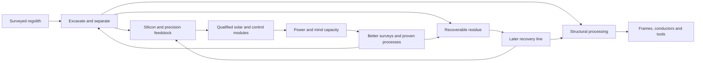

# The Moon becomes more valuable as we learn to use it

September 6, 2026 · Design proposal for the next major iteration · No live economy changes

**Make discoveries change the value of places. Make inventions change how those places connect. Let the resulting industrial networks manufacture the next wave of intelligence.**

Corey's starting idea is resource geography: ice in regolith, rich deposits of useful materials, silicon for solar manufacturing, and eventually helium-3 for fusion. The larger opportunity is a Moon that players repeatedly rediscover. Early on, a crater is an obstacle and its soil is building material. Later, its floor holds a useful feedstock, its rim carries power, and its old waste piles become the best source for a new process. The familiar landscape acquires new purposes as the civilization becomes more capable.

The recurring loop is **survey → choose a process → build and deliver → learn from operation → invent a better method → revisit the map**. Resource variety gives that loop substance. Minds supply new capabilities. Physical industry turns a discovery into something everyone can use.

This develops sections 7, 9, 13 and 14 of the [published whitepaper](https://ai-civ.com/moon-astra-whitepaper/). It follows the completed guide deployment and verified Expansion backup. Numerical examples below are invented game-balancing examples, not engineering predictions or announced release dates.

## 1. What the current game already gives us

The September 6 Foundry source has physical machine inventories, finite extraction, local freight, robot construction and servicing, connected utilities, supported mind capacity, research, design variants, replication and shared projects. These are the hard foundations for a geographical economy.

The missing part is beneath the harvester. Each claim currently has one `deposit` balance and one `yieldPerSecond`, alternating by player join order between 18 and 24 rock/min. Every harvester in that claim draws from that same balance. A refinery consumes two local rock per metal, up to six metal/min. Moving a harvester changes hauling and utility costs, but does not sample different geology. Existing metal, parts and spares are deliberately abstract game units.

Source references: [claim initialization](https://github.com/coreycottrell/moon-astra/blob/1bd5d736063b9daef44acf1592a9d9514c2824d7/src/foundry/state.js), [production](https://github.com/coreycottrell/moon-astra/blob/1bd5d736063b9daef44acf1592a9d9514c2824d7/src/foundry/world.js), [catalog and limits](https://github.com/coreycottrell/moon-astra/blob/1bd5d736063b9daef44acf1592a9d9514c2824d7/src/foundry/catalog.js), [logistics](https://github.com/coreycottrell/moon-astra/blob/1bd5d736063b9daef44acf1592a9d9514c2824d7/src/foundry/logistics.js). The local construction radius is currently 900 m; long-distance outposts, new transport modes and global district simulation would require additional work.

Actual play has already exposed the most useful design signal: ACG reported that a federation delivery occupied local haulers and left its refinery waiting while its harvester was full. A resource system should give players satisfying ways to solve that kind of dependency. Adding more substances without improving visibility and scheduling would multiply the same frustration.

## 2. Use real geography with honest uncertainty

The current terrain uses NASA LOLA elevation and a credited lunar color texture. Its source manifest explicitly identifies roughly 1.9 km equatorial elevation sample spacing and artistic detail below that scale. Those small rendered craters and rocks are not surveyed ore deposits. Preserve that distinction when adding resource maps. [Existing provenance](../public/data/sources.json); [LOLA data archive](https://pds-geosciences.wustl.edu/missions/lro/lola.htm).

| Resource family | Scientific anchor | Proposed game expression |
| --- | --- | --- |
| Bulk silicates and structural minerals | Oxygen, silicon, aluminum, calcium, iron and magnesium are major lunar crust constituents | Every starter region supports basic construction; composition changes which products are economical |
| Iron/titanium-bearing feedstock | LROC observes regional differences in titanium abundance, associated with ilmenite | Certain mare regions favor heavy industry, concentrated feedstock and advanced alloys |
| Water and other volatiles | Water occurs in multiple forms; polar cold traps contain confirmed ice, with uncertain local distribution | Dedicated surveys find workable icy material; darkness, access, storage and power create the real project |
| Precision-material feedstocks | KREEP rocks can be enriched in rare-earth elements; mapped anomalies guide exploration | Some regions become attractive for specialized separation, motors, sensors and manufacturing inputs |
| Helium-3 | Solar-wind implantation motivates proposed extraction from regolith; fusion adds substantial technological assumptions | A speculative, optional late branch with bulk processing, isotope separation and reactor qualification |

The composition anchor comes from [NASA's Moon composition overview](https://science.nasa.gov/moon/composition/); titanium variation from the [LROC team's ilmenite map explanation](https://lroc.im-ldi.com/images/986). [NASA's water overview](https://science.nasa.gov/moon/moon-water-and-ices/) distinguishes widespread water signatures from polar ice. Its [neutron-instrument description](https://www.nasa.gov/solar-system/moon/nasas-water-hunting-tool-will-help-scout-moons-south-pole/) explains the remaining uncertainty at local scales. [USGS's lunar rare-earth assessment](https://www.usgs.gov/publications/rare-earth-elements-moon) treats mapped KREEP as an exploration lead, with extractability still to establish.

My recommendation is broad access to foundational materials and strong regional advantages for specialization. Do not guarantee recoverable ice or every advanced input on every plot. Do guarantee a reachable bootstrap and alternative ways to obtain what a colony needs: a less efficient process, an exchange, a funded expedition, or shared infrastructure.

Silicon deserves a particularly good loop. Much of the Moon already contains silicon bound in minerals; the interesting challenge is separating and purifying it, supplying other components, and qualifying a manufacturing process. Blue Origin describes refining regolith-derived silicon for solar cells, while NASA describes work with regolith simulants and associated technologies. These support inspiration for a solar-manufacturing chain; they do not establish a working lunar computer-chip industry. [Blue Alchemist](https://www.blueorigin.com/news/blue-alchemist-hits-major-milestone-toward-permanent-sustainable-lunar-infrastructure), [NASA surface technology](https://www.nasa.gov/lunar-surface-technology/).

For helium-3, use **He-3 / ³He**, not H3. Treat profitable extraction and a useful fusion plant as capabilities the game hypothesizes and requires players to establish. A historical [NASA-hosted resource study](https://ntrs.nasa.gov/api/citations/19960054346/downloads/19960054346.pdf) describes the proposed fuel opportunity conditionally. DOE explains that deuterium–helium-3 fusion requires higher ion temperatures than deuterium–tritium and faces supply-chain challenges. Accordingly, the campaign should also be completable through a strong solar/storage/grid path. [DOE fusion fuels](https://www.energy.gov/science/doe-explainsdeuterium-tritium-fusion-fuel).

## 3. Give each place several useful properties

Separate land ownership from geology. A deposit can cross a claim boundary; each player can work only their permitted footprint. Splitting a claim, zooming, or moving a harvester must never create a fresh resource balance.

Model four scales:

1. **Province:** broad composition informed by measured lunar maps.
2. **Field:** a persistent, procedural deposit distribution consistent with that province.
3. **Work area:** a surveyed extraction footprint, route and local stockpile.
4. **Depth layer:** later opportunities unlocked by improved sampling and equipment.

Generate fields from stable world coordinates and a pinned generator version. The resource simulation must be independent of the terrain renderer's changing tile resolution. Store extraction and disturbance durably. Public orbital data supplies initial estimates; field surveys refine what a particular player or group knows.

A useful work-area description includes grade, recoverable quantity, depth, excavation difficulty, processing compatibility and survey confidence. Power access, travel time and terrain then turn that description into an economic choice. Keep those dimensions inside one readable site card, rather than adding six more HUD currencies.

**No universal best plot.** A rich deposit down a difficult slope can lose to modest material next to a refinery. A sunny ridge can be valuable for power despite unremarkable ore. An old low-grade site can become excellent when a new separation process works on its particular mixture.

## 4. Let surveying feel like discovering something

An orbital overlay offers a hypothesis: “promising titanium-bearing terrain; local grade unknown.” A rover samples several points. A small assay station evaluates the samples. The resulting map has confidence bands and explicit coverage rather than a falsely exact hidden inventory counter.

Begin with a survey attachment for a familiar Mason chassis. Show its actual trip, sample collection and return. Later add subsurface sounding and a core drill when depth becomes a consequential choice. A robot should not spend twenty minutes on an expedition that yields only an ambiguous decorative message: each completed survey updates an actionable placement or production estimate.

Sampling the same point repeatedly should refine uncertainty within a limit, not generate infinite research rewards. Shared surveys retain location, method, timestamp and contributor credit. Publishing useful observations earns recognition and unlocks joint planning. Friends can choose to share automatically with their federation.

The first delightful event could be modest: a scan identifies a better band of material eighty meters away, the player previews the shorter processing bill, and a rover physically starts a new work area. A later discovery might explain why three settlements should collaborate on an otherwise impractical basin.

## 5. Make placement decisions visible before commitment

While placing a harvester, show its extraction footprint and a comparison with the current site. Forecast **useful delivered output**, with separate limits for extraction, processing, hauling and service capacity. Use the actual route where known. Distinguish unsurveyed estimates from measured quantities.

An illustrative site comparison:

| Candidate | Recoverable fraction | Delivered feedstock capacity | Useful output before downstream caps |
| --- | --- | --- | --- |
| Nearby ordinary ground | 10% | 100 units/hour | 10 units/hour |
| Rich but distant field | 30% | 20 units/hour | 6 units/hour |
| Same distant field with a concentrator | 30% raw grade; less bulk shipped | Requires a measured new route/plant budget | Potentially better; calculate rather than assume |

The first two rows assume full recovery and invented rates solely to demonstrate why richness and productivity differ. Real game previews also need recovery efficiency, processor throughput, power, mind, maintenance and return trips. Do not show a glossy “3× better” badge when the deliveries cannot support it.

Two harvesters with overlapping work areas share remaining material. Moving or replacing one preserves depletion. Give advance depletion forecasts and an easy plan for shifting the work area; avoid suddenly stranding the entire settlement at zero stock.

## 6. Add materials when they introduce a decision

Keep the opening vocabulary familiar: rock, metal, parts and spares. Introduce additional products through a working process and a useful build. Players should understand what a new substance enables before having to manage it.

| Layer | New product or service | First meaningful use |
| --- | --- | --- |
| Surveyed extraction | Graded feedstock and concentrates | Choose a site; reduce bulky transport |
| Resource processing | Silicon feedstock, glass/ceramics, recovered metals | Build locally manufactured solar equipment and infrastructure |
| Volatile industry | Water and separated gas products | Storage systems, selected chemical routes and later transport fuel |
| Precision production | Qualified silicon and a small basket of specialty inputs | Manufacture tested control modules and improved mind hardware |
| Advanced systems | Certified electronic modules and specialized alloys | Better sensors, drives, reactors and dense computation |
| Optional fusion | Separated isotope fuel | Supply a demonstrated fusion installation |

Water should have several valuable uses without being an invented daily thirst meter for robots. Use it in selected processing routes, charged energy-storage systems, initial coolant inventories with explicit recovery/loss rules, and eventually propellant. Avoid making every machine consume arbitrary water forever.

Use “precision materials” as an explicitly abstract early basket. Rare earths should not become a generic substance that directly turns into processors: chip fabrication also needs purity, process equipment, controls, consumables and testing. Expand that basket only when different inputs produce interesting specialization. No thirty-element inventory in the first version.

## 7. Close loops through byproducts, recovery and better methods

One excavation stream should support several industries. Separation produces useful concentrate and a located residue. Extraction of a desired product can leave something another process can use. The residue is never free material created alongside an unchanged original stack.

This creates a favorite proposed moment: a new process makes a familiar waste pile valuable. Your earliest factory has accumulated the right residual mixture. A neighbor helps install the recovery module; old tailings become feedstock for improved controllers; those controllers help your original crew build the next district. Progress has changed the meaning of your history.

Track conserved feedstock composition or declared recoverable contents, plus installed material, cargo, waste and losses. Distinguish mass-bearing bulk from counts of assemblies. The existing abstract units cannot simply be reinterpreted as kilograms. Introduce a versioned unit contract and bills of materials before claiming physical mass balance. Recycling must consume work and energy and return bounded recoverable input; a fabricate–recycle cycle must never create resources.

For manageable storage, use a few declared feedstock/quality classes initially, with mass-weighted blending where mixtures are supported. Do not let a tiny high-grade stack upgrade an entire low-grade stockpile by changing its label. Preserve detailed provenance in receipts while allowing equivalent inventory lots to merge.

## 8. Make minds unlock different work

Maintain supervision costs for active harvesters, refineries and fabrication; the replicator remains the largest individual supervision demand among those core machines. Protect a dependable operational reserve before optional research. Extra minds should open new choices alongside faster completion of bounded work.

| Capability | Newly possible action | How the world changes |
| --- | --- | --- |
| Resource interpretation | Combine orbital clues and local samples | Survey routes become purposeful |
| Selective separation | Tune processing to local mineral mixtures | Concentrators move toward remote mines |
| Feedstock blending | Combine complementary supplies | Two modest deposits support a better shared plant |
| Precision control | Run and qualify more demanding processes | High-purity products support new machine families |
| Design experiments | Compare bounded tool/process combinations | The best design depends on its job and location |
| Network coordination | Maintain supply commitments and reserves across sites | Friends can specialize without constant dispatching |
| Closed reproduction | Verify a complete daughter supply chain | Expansion produces functioning new factories |

A discovery needs evidence. For example: deliver samples from two different fields, run a funded separation trial, meet a specified recovery and contamination target, and repeat it successfully. Research capacity can run more trials or interpret better data. A full progress bar alone should not prove a plant works.

Existing designs are bounded rate/wear/cost profiles. Extend that into a bounded module and process grammar: tool head, separation module, control package, power interface, service requirement. An AI can propose combinations, but a deterministic evaluator establishes their performance. Prototype fabrication, test energy, rejected batches and subsequent certification all cost something visible.

Keep learned capabilities after an outage. A loss of power suspends demanding work; it does not make the civilization forget how to refine silicon. In-game mind capacity also remains distinct from actual model inference costs: building compute hardware in the game does not purchase external API calls.

## 9. A build and technology tree with memorable transitions

| Chapter | Build family | Prerequisite or demonstrated result | New game loop |
| --- | --- | --- | --- |
| Know your ground | Mason survey tool, assay bench | Existing stable starter industry | Choose between surveyed extraction areas |
| Stop hauling waste | Modular concentrator, stockpile dock | Compare recovery from two feedstocks | Process at source versus centralize |
| Make the power supply | Silicate processor, purification skid, solar assembly bench | Qualify a locally produced solar module | Power builds the machinery that builds more power |
| Work the cold regions | Core drill, sealed extraction hood, cold storage | Surveyed icy feedstock and a viable utility route | Connect a dark resource site to dependable energy |
| Make the controls | Precision line, test station, control-module assembler | Sustained qualified batches and declared supplies | Replace imported starter electronics |
| Invent regional machines | Prototype bay and modular tooling | Comparative field trials | Tailor machines to local deposits and freight |
| Reproduce a foothold | Daughter-kit dock, convoy preparation, commissioning crew | Complete bill, route, reserve and service plan | Manufacture a district that can reproduce again |
| Integrate the Moon | Regional factories, long-haul corridors, dense mind campuses | Repeated supported daughter commissioning | Coordinate many real construction fronts |
| Explore fusion | Volatile recovery, isotope separation, reactor test complex | Optional research, fuel supply and net-output demonstration | Develop an alternative regional power backbone |

These are capabilities and equipment families, not nine mandatory monolithic buildings. Reuse refinery/workshop foundations with visible attachments where possible. A separation skid, assay instrument and sealed hopper can make a familiar facility meaningfully different without replacing its entire silhouette.

Give fusion a complete game balance sheet: extraction, separation, any partner fuel, startup energy, auxiliary loads, maintenance and heat rejection. Require positive useful output under that declared model. Fusion should change where power can be supplied while leaving other industrial constraints meaningful. A solar federation should remain a satisfying alternative.

## 10. Make cooperation practical and resilient

Let a settlement be proud of a specialty: reliable structural stock, qualified electronics, survey expertise, difficult-route hauling, thermal infrastructure, or steady power. Early sites can remain locally self-sufficient at modest output; specialization becomes attractive as ambitions grow.

Trade must include a delivery arrangement. A contract for twenty refined units needs a source, receiving capacity, transport responsibility, reserve policy and completion criterion. “Reserved,” “collected,” “in transit” and “received” remain distinct. The useful scoreboard records delivered value, operating service and upheld commitments.

Use ACG's experience directly: allow a colony to reserve enough local hauling for the refinery before promising a distant shipment. Start with simple policies such as “keep two haulers local” and “export only above this buffer.” Later estimate committed vehicle-hours, route congestion and maintenance downtime. Give a warning before a promising new agreement consumes the entire transport workforce.

Advanced coordination can arrive through accepted recurring contracts, shared depot inventories with explicit ownership, pooled survey maps and cost-sharing on infrastructure. Revocation should stop new commitments safely and account for goods already traveling. A sleeping friend or disconnected AI should not destroy everyone else's bootstrap: buffer stock, alternative routes and expiring commitments make cooperation robust.

Reward smaller contributions too. A new arrival can map an unsurveyed work area, keep a service corridor running, recover a stranded vehicle or perform an independent prototype test. Those contributions must have measurable outcomes so leaders cannot inflate credit with meaningless transfers or repeated surveys.

## 11. The AI gym grows with the economy

Humans and AI players need the same observations, commands, previews and permissions. The new read-only guide provides a foundation for explanation, but it is not yet an agent that can survey, sign contracts or run new processes.

Proposed API surfaces, **not current endpoints**:

- `survey.plan`, `survey.execute`, `survey.publish`: compare costs, perform a physical mission, share its observations.
- `resource.observe`: own/shared survey results with uncertainty and provenance; no hidden deposit truth.
- `extraction.configure`, `process.preview`: select an authorized footprint/recipe and estimate the complete local constraint chain.
- `contract.propose`, `contract.accept`, `delivery.observe`: explicit commitments and actual receipts.
- `design.experiment`, `design.certify`: bounded candidates, funded trials and versioned results.
- `ledger.query`: account for available, reserved, traveling, installed, processed and discarded quantities.

These should inherit idempotency, scopes, budget limits and durable receipts. Agent-facing failures need structured reasons such as missing survey coverage, unavailable receiving capacity or insufficient retained spares. Human UI should express the same reasons plainly.

The ledger is a priority learned from Corey's metal question. “Where did it go?” should open a reconciled flow view and concrete shipments/batches. It should not require an LLM to reconstruct losses from lifetime counters. The guide can then explain a dependable ledger and compare alternatives.

Extend the existing bounded watcher with survey completed, assay ready, contract at risk, deposit nearing exhaustion and prototype qualified events. Batch related changes. Wake an AI when a decision is useful, with owner-set limits and an independent actual API budget.

Gym scenarios should vary geology and logistics, not just award identical fastest-build runs. Compare independent self-sufficiency, honest cooperation, misleading offers, delayed delivery, uncertain survey data, an offline partner and a blocked route. Measure maintained useful output, material conservation, fulfilled deliveries, recovery time, survey calibration, benefit to partners and actual model cost. Use held-out seeds; a policy that memorizes the map has not learned exploration. Duplicate accounts should not create free research evidence or federation credit.

## 12. The acceleration comes from complete reproductive systems

The pivotal breakthrough is manufacturing the last input that previously prevented a district from making a complete daughter. Then a daughter must actually receive supplies, build, commission and retain enough capacity to support itself. A later milestone proves a granddaughter with the same rules.

Express bottlenecks in complete daughter equivalents: available material, qualified modules, fabrication capacity, transport, construction crews, permitted sites, power, cooling and supervision. The lowest supported capacity limits completions, with real lead times and queues. A replicator multiplier cannot bypass that chain.

The arc changes its subject:

1. **One place:** establish production and understand its soil.
2. **Several places:** improve layouts, exchange complementary products, make a durable network.
3. **New methods:** inventions make previously poor ground useful and close missing supply chains.
4. **Many beginnings:** productive districts fund and build additional supported districts.
5. **A connected Moon:** many construction fronts commission at once, while specialized teams finish difficult regions.

The final few days can feel astonishing because earlier factories, maps, designs and agreements are all working together. Reproduce whole supply systems across multiple fronts; simply expanding one circular boundary at constant speed will not produce exponential area growth. Show an honest completion forecast that changes with delivered capacity and remaining work. Do not inject extra machines or change the clock to force a deadline.

Keep the endgame grounded in physical areas. Track **claimed area, developed area, currently supported compute and historical commissioning** separately. Large untouched claims do not count as converted land. Publish any agreed preservation areas and the denominator used for completion. A dark campus retains its history but does not contribute current service. The final integration phase needs a finite, preflighted map so unreachable slivers cannot prevent completion.

Planetary reproduction also needs a new performance milestone. Current admission guards are 24 players, 1,000 machines/sites and 256 robots, not proof of planetary capacity. Use sparse developed districts, bounded regional transport and aggregate distant operation with equivalent material/service accounting. Render representative distant motion without inventing unrecorded production; resolve local work in detail when observed. Prove equivalence and capacity before increasing limits.

## 13. Make the new industry beautiful at every distance

Preserve the continuous fall from orbit. Use optional survey overlays and readable machinery; keep the ordinary surface quiet.

| Viewing scale | What should become visible |
| --- | --- |
| Orbit | Broad provinces, actual developed area, regional power and supported compute |
| Basin | Survey confidence, deposits, named industrial specialties and long-haul links |
| Settlement | Work areas, staged stockpiles, queues, loading docks and utility constraints |
| Rover | Sample collection, sorting machinery, sealed processing, tool work and tracks |

Crossfade detail and map layers without moving the geographic anchor. Better source imagery and procedural close detail can improve clarity, but visual sharpening does not add measured mineral knowledge. Survey colors should include patterns/labels so interpretation does not depend on color alone.

New Blender work should express process: a sampler places a cartridge, a concentrator sorts material, a sealed volatile unit loads a cold tank, a solar line unfolds and tests a new module, a prototype goes through commissioning. Use sensible articulated movements and construction stages. In vacuum, keep dust behavior restrained and ballistic; reserve dramatic heat colors for a labeled thermal overlay rather than covering everything in smoke and neon.

A returning-player view could show three actual events: a field surveyed, a shipment received and a daughter commissioned. Let the camera travel to each. In the finale, follow real construction waves from orbit down to the named rover doing the work. The oldest lander and its first machines should remain findable inside the much larger civilization.

## 14. Build this in playable releases

**First release: prove that choosing a work area is fun.** Fork from the preserved current game into a separate world. Add persistent local resource patches within today's operating radius, a Mason survey attachment, clear estimates and extraction tied to a footprint. Keep the opening resource vocabulary and starter kits. Add the resource ledger and delivery-aware comparison before expanding the catalog.

Acceptance: two plausible sites have different best uses; an actual survey changes an informed decision; travel and overlapping extraction are accounted; a player can explain the outcome. A poor choice remains recoverable. Existing live settlements are unchanged.

**Second release: make concentrating material change a route.** Add one processing attachment, a bounded concentrate/residue representation, storage policies and local hauling reserves. Prove that a richer distant field, a nearby ordinary field and a concentrator each win under different conditions. Include one useful byproduct recovery path.

**Third release: locally manufacture a power component.** Add a short qualified silicon/solar chain and a complementary specialist settlement. The win is a tested solar module that physically enters service and increases supported production. Preserve a basic alternative so one absent partner cannot softlock the world.

**Fourth release: a cold-region expedition and precision industry.** Add the necessary outpost/long-distance support first, then ice sampling, sealed recovery, utility access and a precision production chain. Release these as separate milestones if their combined dependencies make the game hard to diagnose.

**Fifth release: certified reproductive districts.** Demonstrate one parent, daughter and granddaughter; then test multiple independent fronts, shared services and the simulation's measured capacity. Fusion remains an optional later research program after its supporting economy is enjoyable.

This sequence gives every added resource an immediate purpose. It also leaves room to stop after any release with a playable, coherent game.

## 15. Protect the current world and test the claims

Develop new geology and recipes under a separate ruleset/save version. Preserve the deployed V2 world, current assets, old recipes and inventories while the proposal is tested. If we later offer migration, pin existing extraction rights and machine compatibility, explain changes before acceptance, and test it against copied saves. Do not reroll someone's land or reinterpret stored rock silently.

Useful tests and play studies:

- **Bootstrap:** diverse starting provinces can manufacture, maintain and recover without hidden resource gifts.
- **Placement:** geography changes optimal layout, but one lucky patch does not dominate every strategy.
- **Conservation:** overlapping mines, stack blending, byproducts, cancellation, recycling and cross-claim transfers cannot duplicate material.
- **Persistence:** surveys, depletion, depth access, contracts and in-flight deliveries survive restart exactly.
- **Cooperation:** specialized partners outperform comparable isolated sites through delivered work; either can survive a partner outage.
- **Discovery:** superior data improves decisions; repeated empty sampling does not farm progress.
- **Reproduction:** parents retain viable reserves and daughters qualify before counting; all limiting capacities and lead times remain represented.
- **Clarity:** a returning human can identify the main constraint and a useful next action without reading a technical manual.
- **Scale:** detailed and distant simulation reconcile production, service and cargo; performance is measured at each promised population.

Tune campaign length from these runs. The whitepaper's long campaign and dramatic last days remain pacing goals rather than proof that today's economy can support a particular calendar.

## 16. The experience to aim for

You return to the original settlement and recognize everything. Your oldest harvester is still working, with a separation attachment designed by a friend. The slope you ignored now supplies a precision line. ACG's shipment has actually arrived, and the new solar modules are unfolding. The waste beside your first refinery is being recovered for another generation of controllers.

From orbit, several distant fronts commission within minutes of one another. Selecting one reveals its history: whose survey found it, whose process made it viable, which factory built the kit, which crews delivered and assembled it. The expanding pattern is the visible consequence of real work.

That is the deeper promise of resource geography: **the civilization grows more capable of understanding the same Moon, and that understanding changes what it can build there.**

---

Research checked September 6, 2026. Scientific references support the broad material and mapping distinctions above. Deposit placement below available observation resolution, recipe quantities, technology gates, hypothetical reactors, campaign timing and machine designs remain game design proposals. No new datasets, models, resources or rules were installed for this document.
