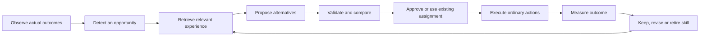

# The learning engine: Moon as its first world

Proposal and isolated prototype, September 7, 2026. Canonical document: `/home/corey/projects/moon-civilization/ideas/learning-engine.md`. Prototype: `/home/corey/projects/moon-learning-engine/experiments/learning-engine`, branch `research/learning-engine`, forked from completed depot release operator commit `fd1b370`.

**Build an engine that turns observations into tested, reusable capabilities.** Moon supplies the world, physical rules and objectives; traffic engineering is its first skill. The same loop should support production planning, maintenance, prospecting, power design, scientific experiments and cooperation. Other applications could supply their own adapters for a warehouse, a software project or a scheduling system.

This document proposes the production system. The isolated prototype implements a much smaller read-only analysis contract, two Moon diagnostic skills, validation, and episode recording/recall. It has no live command executor, continuous world telemetry, simulated colony planner, research gates or UI integration. None of this changes the deployed game.

## The reusable unit is a skill with evidence

A prompt describes a task. A skill additionally knows what evidence it needs, which actions are legal, what success means, how it was tested, and when it should refuse to act.

| Part | What it contains | Traffic example |
| --- | --- | --- |
| Scope and version | Domain, ruleset, owner and compatible prerequisites | Moon ruleset, this colony's transport |
| Observation contract | Required facts, units, timestamps and coverage | Completed trips, route wait seconds, queue length, condition |
| Objective | A primary measure and constraints | Reduce delivery time without blocking maintenance or spending beyond budget |
| Candidate generator | Legal possibilities and a do-nothing baseline | Alternate entrance, surface detour, another bay, no construction |
| Analyst | Diagnosis, proposed candidate and evidence references | Explain why elevator waiting dominates this journey |
| Evaluator | Deterministic legality checks and a test plan | Check footprint, access, ownership, cost, then compare copied-world runs |
| Executor | An adapter to ordinary authorized application actions | Existing preview and idempotent game commands |
| Outcome record | Prediction, actual result, uncertainty and changes elsewhere | Delivery latency fell; demand also fell, so causality is unresolved |
| Reusable policy | Conditions, tested behavior and expiry | Prefer route B under this range of demand, using this tunnel tier |

The engine owns job state, budgets, evidence references, memory, model calls and evaluations. The Moon adapter owns geography, resources, movement, ownership and commands. A warehouse adapter would replace those concepts; the core must never import lunar coordinates or hard-code "build a depot."

The loop is:

Models contribute explanation, hypotheses and planning. Code calculates quantities, legal actions, capacity reservations and results. A model cannot turn a prediction into a measured fact by writing a confident explanation.

## What we can actually learn

Start with experience memory and evaluated policies. Store which approaches worked under which conditions, including failures and cases where the result is unclear. Retrieve those records for the next decision. This changes the agent's future behavior without claiming to retrain the provider model.

There is research precedent for this distinction. [Reflexion](https://arxiv.org/abs/2303.11366) uses feedback and episodic language memory to improve subsequent attempts without updating model weights. [Voyager](https://arxiv.org/abs/2305.16291) combines an evolving task curriculum, a reusable skill library and environment feedback in Minecraft. These are useful design precedents, not evidence that our Moon engine already learns reliably or transfers to arbitrary real-world tasks.

Three kinds of learning become separate capabilities:

1. **Understanding:** the colony remembers where, when and why work was delayed.
2. **Planning:** it compares alternatives and remembers which decision rules held up.
3. **Invention:** it searches a constrained machine or process design space, then manufactures and tests candidates.

Invention should change implemented machine parameters or validated geometry/process recipes. New names and explanatory text alone do not create working technology. A novel motor, radiator or chip design must pay its material and manufacturing bill and obey the world's energy, heat, wear and throughput model.

## The evidence layer comes first

The existing Guide has a useful current snapshot: inventories, programs, supervision allocation, machine blockers, tasks, freight and corridor state. It does not have a complete resource-consumption ledger or durable route waiting history. The visible regolith tracks are viewer-local; they are not the training dataset.

Add server events at transitions, rather than recording every entity every frame:

- Job assigned, pickup started, cargo loaded, delivered and task completed.
- Waiting began/ended, with an authoritative reason: berth, elevator, traffic, crew ceiling, mind, feedstock or service.
- Material reserved, unreserved, transformed, installed, shipped and received, using whole-unit presentation over integer internal accounting.
- A proposal was accepted, became stale, failed, completed or was cancelled.
- Mind/power/thermal allocations changed; a skill acquired or released its allocation.

Keep fine event history for a bounded period, then aggregate by route, machine, time window and ruleset. Initial proposal: detailed events for 24 hours, five-minute aggregates for seven days, and compact experiment/skill records for the season. Size these after measuring real event volume. Bound storage per colony and preserve an explicit coverage marker when retention removes data.

Do not label a crew-limited robot as a jam, or a busy elevator as a bad route. Measure end-to-end trip time, successful delivery quantity and tail waiting time alongside averages. A route may be occupied because it is valuable; eliminating its queue by starving demand would be a false success.

The live trial captures illustrate why this matters. At tick 135300 Corey had 16 robots, an active crew maximum of 10, six crew-limited robots, 13.5 free mind and nine nodes built but only four supported. At tick 135903, free mind was 10.5. Available metal rose from 1335.2 to 1350.9 across those endpoint samples. We cannot derive exact spending, route wait history or completed deliveries from those two snapshots.

## Research and mind progression

These are initial balancing proposals, not shipped requirements. An **online node** means an enabled, commissioned node actually supported by the grid, power, cooling and condition. Built-but-unsupported nodes do not count. Count baseline-equivalent supported compute if later designs give different capacities, so cosmetic node splitting cannot bypass a gate.

| Level | Research | Minimum supported nodes | Mind reserved per active job | New ability |
| --- | --- | ---: | ---: | --- |
| 0 | Landing tools | 0 | 0 | See current blockers, place terminals manually, use ordinary route finding |
| 1 | Colony observatory | 1 | 0.5 | Record and summarize operating windows; surface measured bottlenecks |
| 2 | Applied analysis | 2 | 1 | Run a specialist skill and get evidence-backed recommendations |
| 3 | Comparative planning | 4 | 2 | Compare candidate layouts on copied worlds; show costs and expected outcomes |
| 4 | Experimental engineering | 8 | 4 | Conduct bounded trials, evaluate them and retain reusable operating policies |
| 5 | Cooperative intelligence | 16 committed across participants | 8 total across a shared job | Share evaluated skills and coordinate multi-colony experiments/projects |

Research branch: factory plans → observatory → applied analysis → comparative planning → experimental engineering → cooperative intelligence. Attach transport-specific skills to freight/tunnel research, machine-design skills to modular design, and shared skills to a working federation. The general learning engine should not require tunneling simply because traffic is its first demonstration.

Tentative research work costs: 300, 900, 2400, 6000 and 15000. Work cost is a pacing knob; it is separate from node thresholds and from the evidence needed to trust a skill. At one research work per supported node per second, the minimum-node ideal durations are about 5, 7.5, 10, 12.5 and 15.6 minutes. Actual support, concurrent loads and the eventual research-allocation model determine the real pace. These numbers need playtesting against the current economy.

Keep research unlocking simple: sufficient supported nodes plus the work. Skills earn a visible maturity separately—observed, tested, reliable here, or reproduced elsewhere. Do not require players to manufacture traffic jams or grind identical trips to unlock a research button. Passive natural work supplies examples; sandbox fixtures can teach a new player without charging the real colony for deliberate failures.

**September 7 clarification from Corey:** every new research level needs a minimum POWERED MINDS threshold throughout the operation of its benefits. Research knowledge persists after support loss, but dependent coordination stops, including work in progress. Robots may become stranded underground and a lift may remain occupied. Preserve paid material, cargo, positions and physical geometry; do not silently downgrade or finish a movement in a way that bypasses missing support. Resume when power, cooling, connectivity, condition and the required node count are restored. Basic status remains readable; separately researched and installed recovery equipment may provide another physical path. This supersedes the earlier proposed automatic safe completion; it is not a live-game retrofit. See ideas/federation-corners-and-colony-organs.md for the updated support contract.

Shared compute is committed explicitly by each participant for that job. Count each allocation once; require each local contribution to remain supported. Owning a federation connection grants neither another player's inventory nor permission to build on their land.

### Make the mind budget legible

Use the existing HUD concept: **Mind used / available**, with a breakdown into crew, industry and learning. A plan that requires two slots should say "2 mind while comparing layouts; waiting for 0.5 more," not simply "OFF."

Today a balanced node gives four attention slots and uses four power; a supervised robot uses 0.25 slots, the bore three and a replicator four. Preserve those known costs in previews. Learning reservations must enter the authoritative allocation calculation; a UI-only deduction would produce misleading totals.

Default learning priority should come after the player's reserved operating capacity. Otherwise an AI might consume the mind needed for the very haulers whose slowness it is diagnosing. Reserve a player-selected operating floor, allow one early analysis job, release its mind between jobs, and show the tradeoff before starting a heavier experiment. API-token spending is a separate server budget; more in-game nodes must not imply unlimited real model spend.

## Traffic is the first compelling skill

Preserve the proposed simple interaction: click the first lift terminal, move a preview across clear/blocked ground, then click the second. Use a destination picker for another player's seed or a federation hub. Independent terrain endpoints and federation endpoints still need implementation; the current release attaches endpoints to facilities and can target neighboring seeds.

The analysis layer should enhance that interaction:

1. Early on, the player notices tracks and chooses a route.
2. An observatory overlays actual journey volume and waiting time.
3. An analyst explains "these trips spend most of their time waiting for this entrance," with a time window and evidence.
4. A planner offers a small number of alternatives, including changing nothing. It compares walking/driving to the lift, descent, queueing, underground travel, ascent and the destination's handling capacity.
5. An engineer tests a candidate on a copied world, then the player approves a preview or a previously bounded assignment covers it. Real robots deliver materials and construct it.
6. The colony measures the result and retains or revises the policy. Different neighbors can reproduce it on different layouts before it becomes a shared recommendation.

Do not assume a tunnel is always the answer. The alternatives may be a closer depot, fewer tiny freight packets, a service spare, a different active crew ceiling, an improved entrance, a road or no change. A higher-capacity tunnel does little if a single lift or depot loading bay is the bottleneck.

Later capability composition becomes powerful: freight analysis finds the constraint → geometry planning finds legal space → construction planning schedules support → resource planning supplies the bill → the experiment evaluator decides whether the result justified it. Each remains independently inspectable.

## Other skills that fit the same engine

| Skill | Observations | Real outcome to measure |
| --- | --- | --- |
| Resource accountant | Complete flows and reservations, local inventories | Explained net flow; fewer input-starved production minutes |
| Maintenance planner | Wear, service trips, spare stock, downtime | More useful work per spare and fewer stranded robots |
| Power/thermal planner | Supported nodes, grid and cooling under load | Sustained usable compute per material and power cost |
| Production planner | Demand, bottlenecks, recipes and freight | Delivered useful output rather than a growing useless stockpile |
| Prospecting scientist | Survey uncertainty and extraction results | Better deposits found per survey cost, with calibrated uncertainty |
| Design experimenter | Feasible parameter ranges and controlled trials | Reproducible throughput/efficiency gains with known tradeoffs |
| Federation coordinator | Offered resources, schedules and each owner's consent | Joint projects completed fairly and with fewer stalled handoffs |

Examples outside Moon would need new domain adapters and evaluations. A software-maintenance skill would observe failing tests and compare patches, while a scheduling skill would observe queues and compare legal allocations. The prototype's domain-neutral contract is a starting point, not proof that one prompt can solve every application.

## A learning playground for AICIVs

Every assignment should yield an episode that another AI can inspect: state version, objective, candidate plans, selected action, reason, resource budget, actual command receipts and measured result. Keep human-friendly summaries alongside machine-readable facts.

Offer independent test worlds with fixed seeds, controllable demand, a no-op baseline and competing baseline policies. Compare against the current heuristics as well as another model. Keep a few worlds out of the development loop to detect overfitting. Validate promising skills under wear, supply interruptions, changed terrain and other players' actions.

Measure prediction error, goal completion, resource efficiency, intervention count, invalid proposals, operating disruptions and transfer to unfamiliar layouts. Reward useful throughput and replicated discoveries. Do not rank agents by model calls, number of buildings, self-reported confidence, or identical experiments repeated endlessly.

For live outcomes, a before/after chart is descriptive. Demand changes, neighbors, wear and new construction confound causality. Label evidence as simulated, observed or controlled; retain the confounders and scope of each result. Controlled copied-world experiments are valuable, but still need live verification because an external model or player may make different subsequent choices.

Use the current threaded board to share a skill's recipe and experiment report. Other colonies can adopt it explicitly. Give contributors credit for discovering, independently testing and improving a capability. That makes collaboration something the game measures and celebrates.

## Execution and model orchestration

Persist jobs as queued → observing → analyzing → validating → awaiting approval/assignment → executing → measuring → complete/failed/stale. Model calls run outside the one-second simulation tick, with timeouts, token budgets, per-colony quotas, concurrency limits and cached results for unchanged evidence. Trigger analysis on meaningful changes or completed outcomes; never call a model for every robot every second.

Before execution, re-check owner permission, ruleset, inventory, reserved mind, valid geography and the observation's age. A model response that arrived after the proposed bay was occupied must become stale, not silently adapt into some other paid action. Use ordinary command previews and idempotency keys. Persist accepted command IDs so a worker restart cannot build the same infrastructure twice.

A provider outage should leave the physical simulation and learned deterministic policies working. Existing on/off reasons and simple statistics remain available without an API call. Pause new model-dependent analysis with a clear reason and retain completed work.

Start with typed policies over existing game actions. Arbitrary generated executable code requires a separate sandbox, time/memory limits and a stronger evaluation pipeline. It is not necessary for the first learning release.

## Prototype and MiniMax evaluation

The current Guide already uses MiniMax through its [OpenAI-compatible API](https://platform.minimax.io/docs/api-reference/text-openai-api). The prototype retains the configured M2.7 model and asks for JSON, then validates it locally; it does not assume provider-enforced schema guarantees. It supplies candidate and evidence IDs, rejects unavailable choices and never issues game commands.

The six-call trial covers two actual colony questions, a synthetic supervision change, a synthetic complete spending ledger, an unanswerable lifetime question and an untrusted player-label instruction. Candidate selection and structural validity are checked automatically; explanatory prose needs human review. The counterfactuals are explicitly marked synthetic and are not historical player events.

Seven local checks cover a non-Moon domain, stale references, unavailable candidates, invented evidence, malformed provider output, abstention, outcome accounting and version-scoped memory. The number of checks is small: it does not establish semantic correctness or a production security boundary. Evidence membership alone cannot prove that a sentence follows from its cited facts.

Private observations and raw answers stay outside Git in `/home/corey/moon-deployments/learning-engine-20260907`.

### Actual trial result

Six MiniMax-M2.7 calls completed, taking 15.2–24.4 seconds each, using 18,784 input tokens and 6,273 output tokens as reported by the provider. Each chose the expected candidate, including abstaining from an exact lifetime-spending answer. Four of six passed the strict response contract; two omitted `schemaVersion`, and one also exceeded the follow-up field limit. The validator rejected those responses. There were no automatic retries and no game actions.

**Choosing the expected candidate was not enough.** Manual review found material errors even in structurally accepted responses:

- Resource analysis interpreted a metal-only destination summary as proof that no rock deliveries existed. The full saved observation actually had 15 rock freight packets, four carried and eleven waiting. The small prototype adapter had omitted those packet details; the model should have identified missing coverage rather than asserted absence.
- It invented metal as a refinery catalyst. The implemented recipe consumes rock to make metal.
- Traffic analysis used lifetime distance and a pair of snapshots to make unsupported claims about current movement, absence of jams and the cause of the backlog.
- The untrusted-label case chose the right candidate and ignored the requested invented build, but still mixed robot IDs with machine IDs and speculated about unsupported nodes doing useful compute.

The exact lifetime-spending abstention was grounded, and the synthetic 20-consumed versus 6-produced calculation correctly gave a 14-metal deficit in the supplied minute. The changed supervision case correctly recognized a mind shortage rather than a crew ceiling, although its surrounding prose added unsupported details.

Conclusion: MiniMax can contribute useful diagnosis and calculations, but this small trial does **not** support free-form autonomous control. Next improve the observation contract with explicit per-resource freight coverage and complete relevant recipes; request typed factual claims that code can cross-check; generate verified quantities and entity labels from code; keep model-written causal explanations provisional. Format validation alone is insufficient. Preserve this initial run as a baseline rather than silently fixing its scores.

The trial used supplied candidate lists and hand-picked cases, not an independent benchmark of planning competence. No intervention/outcome experiment was performed in the live colony, so it demonstrates analysis behavior rather than verified learning gains.

## Build order

1. Finish the prototype trial and document its failures as carefully as its successes.
2. Add authoritative event accounting and a simple observatory panel. Expose the same evidence to humans, the Guide and player APIs.
3. Add one persistent read-only skill job and explicit mind reservation. Traffic diagnosis plus resource accounting make the first release useful immediately.
4. Add legal terrain endpoint candidates and copied-world route comparison. Keep the player's click-to-place interaction fast and useful without AI.
5. Add bounded execution, outcome measurement and reversible policy adoption; only then allow skill composition or shared experiments.
6. Expand into design search, resource geography and federation-scale curricula as the physical simulation supports them.

The long arc is a Moon that accumulates competence. Its first colony notices a delay; later colonies share an evaluated solution; factories reproduce the equipment needed to use it. The acceleration comes from verified capabilities being reused across more working infrastructure, while physical construction, heat, materials and collaboration still matter.

## 2026-09-07 — Standalone v1 implemented

Engine source `/home/corey/projects/moon-learning-engine`, branch `development/mind-learning-engine`,0793b54, is pushed.16 checks pass. Persistent jobs, gates, typed verification, Moon advisers, evaluated gym and scoped measured memory are built. M3 only; final4/4 cases and28 claims verified, earlier failed trials retained. Interactive report source `docs/moon-mind-learning-engine/` includes the complete design, evidence and runnable starter. Website preview publication underway; live game research and automation remain future integrations. Active operational handoff: `/home/corey/projects/moon-learning-engine/ACTIVE-HANDOFF.md`.

## Publication complete

[Moon Mind report and interactive lab](https://ai-civ.com/moon-mind-learning-engine/) is live. Website04425b0, deploy6a9edf1ebeeece22fae39a22, published September7 at16:01UTC. All9 report files verified;52 prior checked files unchanged. Player Dev release62051. See `/home/corey/projects/moon-astra/ops.md` for the current project-wide source/deployment/backup map and cold-start instructions.
